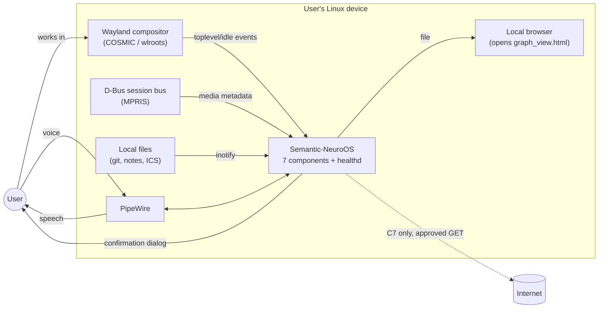
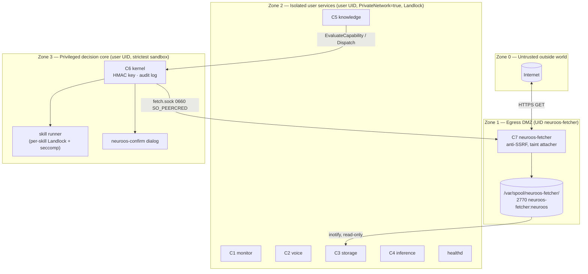
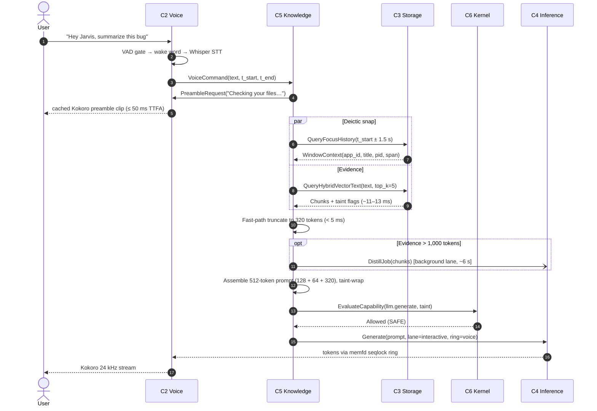
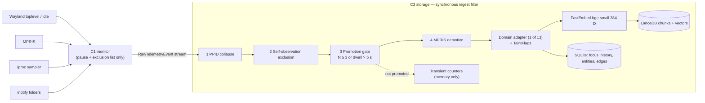
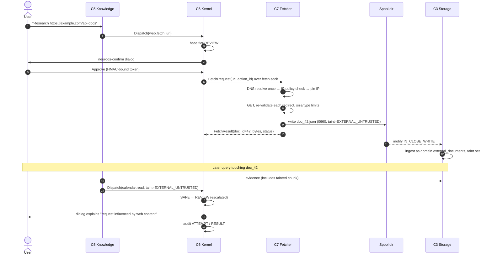

# Architecture — Semantic-NeuroOS

**Document type:** System Architecture Specification
**Document version:** 1.0 · **Date:** 2026-09-26 · **Status:** Baseline
**Implements:** [PRD.md](PRD.md) v1.0
**Governed by:** [rules.md](rules.md) · **Delivered through:** [phases.md](phases.md)

---

## 1. Architectural Principles

| # | Principle | What it means in practice |
| :--- | :--- | :--- |
| AP-1 | **Zero egress by construction** | Isolation is enforced by the kernel (network namespaces, Landlock), not by code discipline alone. Only C7 has a network stack that reaches the outside. |
| AP-2 | **Decoupled components, contract-first** | 7 components + healthd are separate processes. They share nothing except versioned protobuf contracts in `proto/`. Any component can be built, tested and restarted alone. |
| AP-3 | **Single owner per resource** | C3 owns the embedding model and all persistent data. C4 owns the LLM. C6 owns the HMAC key and the audit log. Nobody else touches them. |
| AP-4 | **Least privilege per process** | Each unit declares exactly the paths, sockets and syscalls it needs. Everything else is denied. |
| AP-5 | **Taint is monotonic** | Once data is `EXTERNAL_UNTRUSTED`, every derived context carries the flag. Tiers only escalate, never de-escalate. |
| AP-6 | **Latency is designed, not hoped for** | Every hop has a budget (§9). Slow work (distillation, graph learning) is always asynchronous. |
| AP-7 | **Degrade, don't die** | Losing a component removes a feature, never the system. Clients reconnect with backoff. |
| AP-8 | **Observable from outside** | Health is scraped by an independent daemon; a fault in C6 cannot blind monitoring. |
| AP-9 | **Right language per job** | Rust for services and security, C++20 for SIMD inference and real-time audio, Python only for offline graph maths. |

---

## 2. System Context



---

## 3. Component Catalogue

| ID | Service binary | Language / runtime | Runs as | Network | RSS budget | Latency SLA | Owns |
| :--- | :--- | :--- | :--- | :--- | :--- | :--- | :--- |
| C1 | `neuroos-monitor` | Rust (tokio) | user UID | none | 25 MiB | < 1.5 ms capture | Sensors only; no data at rest |
| C2 | `neuroos-voice` | C++20, ONNX Runtime, whisper.cpp, PipeWire | user UID | none | 405 MiB | ≤ 50 ms TTFA | Audio I/O, STT, the single TTS voice (Kokoro) |
| C3 | `neuroos-storage` | Rust, LanceDB, SQLite, FastEmbed (ort), USearch | user UID | none | 205 MiB | ~11–13 ms query | **All persistent user data**, embedding model |
| C4 | `neuroos-inference` | C++20, bitnet.cpp | user UID | none | 1,590 MiB | 45 ms/token decode | LLM weights (mmap), KV cache, token ring |
| C5a | `neuroos-knowledge-query` | Rust | user UID | none | 30 MiB | < 5 ms own compute | Prompt assembly, deictic snap, graph view render |
| C5b | `neuroos-knowledge-background` | Python 3.12 (NumPy/SciPy) | user UID | none | 45 MiB | batch | Graph learning jobs (writes via C3) |
| C6 | `neuroos-kernel` (+ `neuroos-confirm` dialog, skill runner) | Rust; GTK4 dialog | user UID | none | 15 MiB (+25 transient) | < 0.5 ms check | Skill registry, HMAC key, `actions.jsonl` |
| C7 | `neuroos-fetcher` | Rust | **`neuroos-fetcher`** system UID | **egress** | 10 MiB | network-bound | Spool directory |
| D | `neuroos-healthd` | Rust | user UID | none | 15 MiB | 30 s poll | Health aggregate, soak baseline |
| — | `neuroosctl` | Rust CLI | user (interactive) | none | n/a | n/a | Nothing (client only) |

---

## 4. Trust Zones and Process Boundaries



**Boundary rules**

1. Zone 1 → Zone 2 data flows only through the spool directory, and only as tainted payloads.
2. Zone 2 → Zone 1 requests flow only from C6, only after tier evaluation, over `fetch.sock`.
3. Zone 3 is the only place a skill can execute. C5 proposes, C6 disposes.
4. Same-UID isolation (Zones 2 and 3 share the user UID) relies on Landlock (no cross-reading of files such as `hmac.key`), `NoNewPrivileges=true`, and Yama `ptrace_scope ≥ 1`.

---

## 5. IPC Fabric

### 5.1 Transport

- **Unix domain sockets, filesystem paths only.** Abstract-namespace sockets are forbidden because they are bound to the network namespace and break under `PrivateNetwork=true`.
- **Framing:** `u32` little-endian length prefix + protobuf-encoded `Envelope`. Max frame 4 MiB (configurable per socket, lower for control sockets).
- **Authentication:** every server calls `getsockopt(SO_PEERCRED)` on accept and checks the peer UID/GID against an allowlist for that socket.
- **Bulk streaming:** answer tokens flow from C4 to C2 through a **memfd shared-memory seqlock ring**. The memfd is passed with `SCM_RIGHTS` over `inference.sock`, so no `/dev/shm` names are needed (which also keeps `PrivateDevices`/`PrivateTmp` safe).

### 5.2 Socket map

Runtime directory: `$XDG_RUNTIME_DIR/neuroos/` = `/run/user/$UID/neuroos/` (mode 0700).

| Socket | Server | Clients | Pattern |
| :--- | :--- | :--- | :--- |
| `monitor.sock` | C1 | C3 | Server-push event stream |
| `voice.sock` | C2 | C5 | Request/response (preamble, speak, cancel) |
| `storage.sock` | C3 | C5a, C5b, C6 (forget), `neuroosctl` | Request/response |
| `inference.sock` | C4 | C5a, C2 (ring fd) | Request/response + fd passing |
| `knowledge.sock` | C5a | C2 (VoiceCommand), `neuroosctl ask` | Request/response + progress stream |
| `kernel.sock` | C6 | C5a, `neuroosctl` | Request/response |
| `healthd.sock` | healthd | `neuroosctl status` | Request/response |
| `<component>.health.sock` | each component | healthd | Request/response |
| `/run/neuroos-fetcher/fetch.sock` | C7 | C6 only | Request/response (0660 `neuroos-fetcher:neuroos`) |
| `/run/neuroos-fetcher/health.sock` | C7 | healthd | Request/response (0660) |

### 5.3 Envelope contract (`proto/neuroos/v1/envelope.proto`)

```protobuf
syntax = "proto3";
package neuroos.v1;

message Envelope {
  uint32 schema_version = 1;     // always 1 for package v1
  string trace_id       = 2;     // 128-bit hex, propagated end to end
  uint64 request_id     = 3;     // correlation id; 0 for push events
  uint64 sent_at_ns     = 4;     // UTC epoch nanoseconds
  oneof body {
    Error                error          = 10;
    HealthRequest        health_request = 11;
    HealthResponse       health_response= 12;
    RawTelemetryEvent    telemetry      = 20;
    VoiceCommand         voice_command  = 30;
    PreambleRequest      preamble       = 31;
    // ... one field range per component, see proto files
  }
}

message Error {
  ErrorCode code      = 1;
  string    message   = 2;   // never contains user content
  bool      retryable = 3;
}
```

Field-number ranges per component: 10–19 common, 20–29 C1, 30–39 C2, 40–59 C3, 60–69 C4, 70–89 C5, 90–109 C6, 110–119 C7, 120–129 healthd.

### 5.4 Versioning policy

- Package `neuroos.v1` is frozen after Phase 0 **except for additive changes** (new optional fields, new messages, new enum values).
- Removing or renumbering a field, or changing semantics, requires `neuroos.v2` and an ADR.
- Every contract change needs a round-trip test across Rust, C++ and Python (`tests/contract/`).

### 5.5 Shared-memory token ring (C4 → C2)

```
memfd "neuroos-token-ring" (default 256 KiB)
+-----------------------------------------------------------------+
| Header (64 B, cache-line aligned)                               |
|   magic u32 = 0x4E52_5452 ("NRTR")   version u16   flags u16    |
|   capacity_slots u32   slot_size u32                            |
|   generation_id u64      // bumps on every new answer / cancel  |
|   write_seq u64 (atomic) // monotonically increasing slot count |
+-----------------------------------------------------------------+
| Slot[i] (slot_size bytes, i = seq % capacity)                   |
|   seqlock u32 (odd = writing, even = stable)                    |
|   generation_id u64   token_id u32   flags u16 (EOS, CANCEL)    |
|   utf8_len u16   utf8_bytes[...]  // detokenized text piece     |
+-----------------------------------------------------------------+
```

Single writer (C4), single reader (C2). The reader retries a slot while its seqlock is odd or changed during the read. C4 detokenizes, so C2 never needs the LLM tokenizer. A cancel bumps `generation_id`; the reader discards slots from older generations.

---

## 6. Core Data Flows

### 6.1 Voice query with deictic snapping (hot path)



### 6.2 Telemetry ingest



### 6.3 Web fetch and taint escalation



### 6.4 Barge-in

1. C2 is playing audio. VAD detects speech with probability > 0.75 for ≥ 2 consecutive frames (≈ 64 ms).
2. C2 calls `pw_stream_flush()` (target < 1 ms) and stops the TTS worker.
3. C2 sends `Cancel(generation_id)` to C4 (stops within 1 decode step) and `Interrupted` to C5.
4. C2 re-enters listening mode. If the new speech contains a command without a wake word within 3 s of the barge-in, it is accepted as a follow-up.

### 6.5 Health

healthd connects to every `*.health.sock` every 30 s, reads `HealthResponse{status, rss_bytes, uptime_s, latency histograms, error_counters, build_info}`, reads cgroup `memory.current` for each unit, and stores a rolling window in memory (plus an optional soak CSV under `~/.local/share/neuroos/soak/`).

---

## 7. Data Architecture

### 7.1 Filesystem layout (runtime)

```
/opt/neuroos/
├── bin/                         # installed binaries
├── models/                      # read-only models + manifest.toml (sha256)
│   ├── bitnet-b1.58-2B-4T/ggml-model-i2_s.gguf
│   ├── bitnet-b1.58-2B-4T/tokenizer.json
│   ├── whisper/ggml-tiny.en-q5_1.bin
│   ├── silero/silero_vad.onnx
│   ├── openwakeword/{melspectrogram,embedding_model,hey_jarvis}.onnx
│   ├── kokoro/kokoro-v1.0.int8.onnx + voices.bin
│   └── bge-small-en-v1.5/{model.onnx,tokenizer.json}
└── share/graph-view/template.html

~/.config/neuroos/
├── config.toml                  # single config file, one section per component
└── hmac.key                     # 0600, readable only by C6 (Landlock)

~/.local/share/neuroos/          # ALL persistent user data
├── storage/
│   ├── lancedb/                 # chunks + vectors
│   ├── meta.sqlite3 (+ -wal)    # focus_history, entities, edges, counters, index_meta
│   └── hnsw/                    # USearch indices (only when promoted)
├── backups/<UTC timestamp>/     # 6-hourly atomic snapshots, keep 8
├── actions.jsonl (+ .1 … .5)    # audit log, hash-chained, rotated at 10 MB
├── graph_view.html              # written on demand
└── soak/                        # soak harness output

/var/spool/neuroos-fetcher/      # 2770 neuroos-fetcher:neuroos, files 0660
/run/user/$UID/neuroos/          # sockets (0700)
/run/neuroos-fetcher/            # fetcher sockets (0750 neuroos-fetcher:neuroos)
```

### 7.2 Storage model

**SQLite `meta.sqlite3` (WAL mode, `synchronous=NORMAL`, single writer = C3)**

| Table | Key columns | Retention |
| :--- | :--- | :--- |
| `focus_history` | `id, app_id, title, pid, root_pid, t_start_ns, t_end_ns, dwell_ms` | 14 days raw |
| `event_counters` | `domain, key, count, first_ns, last_ns, total_dwell_ms` | 14 days |
| `aggregates_daily` | `day, domain, key, count, dwell_ms` | 90 days |
| `entities` | `id, domain, kind, label, taint, created_ns, last_seen_ns, permanent` | domain-dependent |
| `edges` | `src, dst, kind, weight, reinforced_ns, hypothesis` | hypotheses: 72 h TTL unless reinforced |
| `chunks_meta` | `chunk_id, entity_id, source, taint, token_count, created_ns` | follows entity |
| `index_meta` | `collection, embedding_model_id, dim, index_kind, p99_ms, updated_ns` | permanent |
| `schema_migrations` | `version, applied_ns` | permanent |

**LanceDB tables**: one per domain family (`attention`, `work`, `knowledge`, `system`, `external`) with columns `chunk_id, entity_id, text, vector[384], taint, t_ns, domain`.

### 7.3 Domain adapters (13) — proposal for OQ-02

| # | Domain | Family | Source | Retention | Default taint |
| :--- | :--- | :--- | :--- | :--- | :--- |
| 1 | `window_focus` | attention | C1 toplevel | 14 d raw / 90 d agg | none |
| 2 | `app_lifecycle` | attention | C1 toplevel open/close | 14 d / 90 d | none |
| 3 | `idle_presence` | attention | C1 idle notify | 14 d / 90 d | none |
| 4 | `process_activity` | work | C1 /proc (collapsed) | 14 d / 90 d | none |
| 5 | `build_job` | work | derived from 4 + window titles | 90 d | none |
| 6 | `git_activity` | work | C1 folder sensor | permanent | none |
| 7 | `notes` | knowledge | C1 folder sensor | permanent | none |
| 8 | `calendar` | knowledge | C1 ICS sensor | permanent | none |
| 9 | `voice_interaction` | knowledge | C5 (question + answer summary) | 90 d | inherits evidence taint |
| 10 | `media_playback` | system | C1 MPRIS (demoted unless interacted) | 14 d | none |
| 11 | `system_resource` | system | C1 sampler | 14 d (aggregated) | none |
| 12 | `assistant_actions` | system | C6 audit mirror (metadata only) | 90 d | inherits |
| 13 | `external_documents` | external | C7 spool | 90 d | **EXTERNAL_UNTRUSTED** |

### 7.4 Taint model

```rust
bitflags! {
    pub struct TaintFlags: u32 {
        const EXTERNAL_UNTRUSTED = 1 << 0; // came from C7
        const USER_PROVIDED      = 1 << 1; // typed/spoken by user (informational)
        const MODEL_GENERATED    = 1 << 2; // produced by C4
        const STALE_INDEX        = 1 << 3; // embedded with an old model id
    }
}
```

Propagation rule: `taint(output) = union(taint(inputs))`. Stored per chunk and per entity. Only `EXTERNAL_UNTRUSTED` changes tier decisions in v1.0.

### 7.5 Lifecycle jobs (inside C3)

| Job | Schedule | Behaviour |
| :--- | :--- | :--- |
| GC vacuum | daily 03:30 local (systemd timer triggers a C3 RPC) | Delete expired rows/vectors, `VACUUM` incremental, LanceDB compaction |
| Backup | every 6 h | `wal_checkpoint(TRUNCATE)` → `VACUUM INTO` snapshot + LanceDB version snapshot → atomic rename into `backups/`; keep 8 |
| Re-index | on `embedding_model_id` change | Background re-embed in batches of 256; queries use the old index until the swap; stale chunks flagged `STALE_INDEX` |
| HNSW promotion | continuous check | When a collection's rolling p99 > 5.0 ms, build a USearch index (M = 16) in the background, then switch |
| Spool ingest | inotify | Parse, validate schema, ingest, delete the spool file |

---

## 8. Security Architecture

### 8.1 systemd unit hardening baseline (all components except where noted)

```ini
[Service]
PrivateNetwork=true            # C7 exempt
NoNewPrivileges=true
ProtectSystem=strict
ProtectHome=tmpfs              # then BindPaths/BindReadOnlyPaths per component
ProtectKernelTunables=true
ProtectKernelModules=true
ProtectKernelLogs=true
ProtectControlGroups=true
ProtectClock=true
ProtectHostname=true
RestrictNamespaces=true
RestrictRealtime=false         # C2 needs RT scheduling for audio; others true
RestrictSUIDSGID=true
LockPersonality=true
MemoryDenyWriteExecute=true    # C4/C2 exempt if ONNX/ggml JIT paths need it (verify in Phase 2/6)
SystemCallArchitectures=native
SystemCallFilter=@system-service
InaccessiblePaths=-/run/systemd/resolve   # PrivateNetwork alone does not block DNS; see note below
CapabilityBoundingSet=
AmbientCapabilities=
UMask=0077
MemoryMax=<per component, PRD §6.2>
Restart=on-failure
RestartSec=2s
```

> **Unit mode (spike S-01, risk R-01):** the preferred deployment is **system template units** `neuroos-<component>@<user>.service` with `User=%i`, because `PrivateNetwork=true` in *user* units needs user namespaces (restricted on Ubuntu 24.04) and `PrivateUsers=` remaps UIDs, which breaks `SO_PEERCRED` checks. S-01 confirms the choice and records ADR-0002.

> **`PrivateNetwork=true` does not block DNS by itself (found empirically in P0-S05, `scripts/check-egress.sh`):** glibc's `resolve` NSS module (`/etc/nsswitch.conf`) talks to `systemd-resolved` over a local socket at `/run/systemd/resolve/`, which an isolated network namespace does not affect — `getent hosts` still succeeds. `InaccessiblePaths=-/run/systemd/resolve` closes this; `scripts/check-egress.sh` proves both the leak and the fix. Omitted on `neuroos-fetcher.service`, the one component that legitimately needs DNS (it is also the one exempt from `PrivateNetwork=true`).

### 8.2 Landlock rulesets (applied at process start, after config load)

| Component | Read-only | Read-write | Notes |
| :--- | :--- | :--- | :--- |
| C1 | `/proc`, Wayland socket, D-Bus socket, configured folders, `config.toml` | runtime dir | Never reads `~/.local/share/neuroos` |
| C2 | `/opt/neuroos/models/{silero,openwakeword,whisper,kokoro}`, PipeWire socket | runtime dir | |
| C3 | `/opt/neuroos/models/bge-small-en-v1.5`, spool dir (read + remove) | `~/.local/share/neuroos/{storage,backups}` | |
| C4 | `/opt/neuroos/models/bitnet-*` | runtime dir | |
| C5a | `/opt/neuroos/share/graph-view`, tokenizer | runtime dir, `graph_view.html` | |
| C5b | Python stdlib + venv | runtime dir | No storage paths; talks to C3 over socket |
| C6 | `hmac.key`, skill manifests | `actions.jsonl*`, runtime dir | Skill runner gets a narrower per-skill ruleset |
| C7 | CA bundle | spool dir, `/run/neuroos-fetcher` | Landlock ABI v4 net rules: connect TCP 443 (80 if enabled) only |
| healthd | cgroup fs (read), runtime dir sockets | `soak/` | |

### 8.3 SafetyGate tier evaluation

```
evaluate_tier(capability, taint):
    base = registry[capability].tier            # SAFE | REVIEW | DANGEROUS
    if registry[capability].disabled: return DENY
    if taint contains EXTERNAL_UNTRUSTED and base == SAFE: return REVIEW
    return base                                 # never lower than base
```

| Base tier | Clean context | Tainted context |
| :--- | :--- | :--- |
| SAFE | auto-execute | **REVIEW** (confirm) |
| REVIEW | confirm | confirm (dialog shows taint reason) |
| DANGEROUS | confirm + typed phrase | confirm + typed phrase (taint reason shown) |
| disabled | DENY | DENY |

### 8.4 HMAC confirmation protocol

1. C6 creates `action_id` (UUIDv7) and a 128-bit `nonce`, and computes `args_hash = SHA-256(canonical_json(args))`.
2. C6 spawns `neuroos-confirm` as a child with the rendered request on stdin. The child shows the dialog ([design.md](design.md) §7) and writes `APPROVE` or `DENY` to stdout.
3. C6 builds `token = HMAC-SHA256(key, action_id ‖ nonce ‖ capability ‖ args_hash ‖ decision ‖ expiry)`, where `expiry = now + 120 s`.
4. The skill runner receives `(request, token)` and re-verifies it with a constant-time compare before executing. Each nonce is single use (in-memory spent set until expiry).
5. The dialog decision never travels over a socket that another component can write to, so a compromised C5 cannot forge approval.

### 8.5 Audit log (`actions.jsonl`)

One JSON object per line. Records are hash-chained: `prev_hash = SHA-256(previous line)`.

```json
{"v":1,"ts":"2026-09-26T10:15:02.123456789Z","kind":"ATTEMPT","action_id":"0192…","capability":"calendar.read","base_tier":"SAFE","effective_tier":"REVIEW","taint":["EXTERNAL_UNTRUSTED"],"args_hash":"sha256:…","trace_id":"…","prev_hash":"sha256:…"}
{"v":1,"ts":"2026-09-26T10:15:09.001Z","kind":"RESULT","action_id":"0192…","outcome":"REJECTED","reason":"user_denied","duration_ms":6878,"prev_hash":"sha256:…"}
```

Outcomes: `EXECUTED`, `REJECTED`, `DENIED_POLICY`, `EXPIRED`, `FAILED`. Arguments are hashed, not stored, so the log carries no personal content.

### 8.6 Anti-SSRF policy (C7)

- Blocked IPv4: `0.0.0.0/8, 10.0.0.0/8, 100.64.0.0/10, 127.0.0.0/8, 169.254.0.0/16, 172.16.0.0/12, 192.0.0.0/24, 192.168.0.0/16, 198.18.0.0/15, 224.0.0.0/4, 240.0.0.0/4, 255.255.255.255/32`.
- Blocked IPv6: `::/128, ::1/128, ::ffff:0:0/96` (checked after unmapping), `64:ff9b::/96, fc00::/7, fe80::/10, ff00::/8, 2001:db8::/32`.
- Resolve once, validate every address, connect to the validated IP with SNI/Host set to the original name (defeats DNS rebinding).
- Redirects: max 3, each fully re-validated. No credentials in URLs. No non-default ports unless allowlisted.

---

## 9. Performance and Latency Budget

### 9.1 Voice query critical path (reference hardware)

| Step | Owner | Budget |
| :--- | :--- | :--- |
| End-of-speech detection (silence window) | C2 | 600 ms (config) — not counted in NFR-PERF-02 start |
| Whisper tiny.en transcription (~3 s utterance) | C2 | ≤ 150 ms |
| VoiceCommand → C5 | IPC | ≤ 0.2 ms |
| Preamble request → first audio | C5 + C2 | ≤ 50 ms |
| Focus snap + hybrid query (parallel) | C3 | ≤ 13 ms |
| Truncate + assemble + taint wrap | C5 | < 5 ms |
| Capability check | C6 | < 0.5 ms |
| Prefill 512 tokens @ 2.5 ms/token | C4 | ≈ 1,280 ms |
| First decode token | C4 | ≈ 45 ms |
| Kokoro first chunk | C2 | ≈ 240 ms |
| **Transcript ready → first answer audio** | — | **≈ 1.65 s (target ≤ 2.0 s p50)** |

Levers if Phase 2 measures slower: prompt-prefix KV cache for the 128-token system block (saves ≈ 320 ms), smaller evidence budget, shorter first sentence.

### 9.2 Memory budget

See [PRD.md](PRD.md) §6.2. Every unit sets `MemoryMax`; healthd alerts at 90% of budget.

---

## 10. Observability

| Signal | Mechanism |
| :--- | :--- |
| Logs | `tracing` (Rust) / `spdlog` (C++) / `logging` (Python) → journald, JSON fields `component, trace_id, span, level, event`. User content only at `debug` and never in release builds by default. |
| Metrics | Exposed in `HealthResponse`: HDR-style latency histograms (p50/p95/p99), counters, gauges, RSS. No Prometheus server (no network). |
| Traces | `trace_id` created at C2 (voice) or `neuroosctl` (text) and carried in every `Envelope`. `neuroosctl trace <id>` reconstructs from journald. |
| Health | healthd aggregate, `neuroosctl status`. |
| Benchmarks | `bench/` harnesses write JSON reports to `reports/bench/`. |

---

## 11. Deployment Topology

| Artifact | Location | Notes |
| :--- | :--- | :--- |
| Unit files | `/etc/systemd/system/neuroos-<c>@.service` (preferred, S-01) | One per component, instantiated with the user name |
| Fetcher unit | `/etc/systemd/system/neuroos-fetcher.service` | `User=neuroos-fetcher`, `Group=neuroos`, no `PrivateNetwork` |
| Target | `neuroos@.target` | Groups all user-side units; `systemctl start neuroos@$USER.target` |
| Timers | `neuroos-gc@.timer`, `neuroos-backup@.timer` | Call C3 lifecycle RPCs via `neuroosctl` |
| sysusers | `/usr/lib/sysusers.d/neuroos.conf` | `g neuroos -`, `u neuroos-fetcher - "NeuroOS fetcher" /var/spool/neuroos-fetcher` ; the desktop user is added to group `neuroos` |
| tmpfiles | `/usr/lib/tmpfiles.d/neuroos.conf` | Creates spool (2770) and `/run/neuroos-fetcher` |
| Install | `scripts/install.sh` → Phase 10 `.deb` | Verifies model hashes, creates `hmac.key`, enables target |

Start order (`After=`/`Wants=`): healthd → storage, inference → monitor, knowledge → voice, kernel → fetcher. Every client tolerates its server being absent (NFR-REL-01).

---

## 12. Tech Stack

### 12.1 Languages and toolchains

| Layer | Choice | Version policy |
| :--- | :--- | :--- |
| Rust | stable, **edition 2024** | Pinned in `rust-toolchain.toml` (1.97.x at baseline) |
| C++ | **C++20**, GCC 13 (Clang 18 for tidy/sanitizers) | CMake ≥ 3.28, Ninja, `CMakePresets.json` |
| Python | 3.12 | Managed by `uv`, locked `uv.lock` |
| Contracts | Protocol Buffers proto3 | `protoc` pinned; `prost-build` (Rust), `protoc --cpp_out` (C++), `protoc --python_out` (Python) |
| Task runner | `just` | `justfile` at root is the single entry point |

### 12.2 Rust crates (allowlist; see [rules.md](rules.md) §4 for policy)

| Purpose | Crate |
| :--- | :--- |
| Async runtime | `tokio` (rt-multi-thread, net, signal, time, macros) |
| Protobuf | `prost`, `prost-build`, `bytes` |
| Errors | `thiserror` (libraries), `anyhow` (binary `main` only) |
| Logging | `tracing`, `tracing-subscriber`, `tracing-journald` |
| Config | `serde`, `toml`, `serde_json` |
| CLI | `clap` (derive) |
| Syscalls | `rustix` (`SO_PEERCRED`, memfd, `SCM_RIGHTS`) |
| Sandbox | `landlock`, `seccompiler` |
| Crypto | `hmac`, `sha2`, `subtle`, `getrandom`, `zeroize`, `uuid` (v7) |
| Time | `jiff` |
| Storage | `rusqlite` (bundled), `lancedb`, `arrow-array`, `usearch` |
| Embeddings | `fastembed` (ONNX Runtime via `ort`) |
| Tokenizer (C5) | `tokenizers` |
| Wayland | `wayland-client`, `wayland-protocols`, `wayland-protocols-wlr`, `cosmic-protocols` |
| D-Bus | `zbus` |
| /proc | `procfs` |
| File watch | `notify` (inotify backend) |
| Bit flags | `bitflags` |
| HTTP (C7 **only**) | `reqwest` (rustls, no default features), `hickory-resolver`, `ipnet`, `url` |
| Dialog (C6 confirm) | `gtk4` |
| Testing | `proptest`, `insta`, `criterion`, `assert_cmd`, `tempfile`, `tokio-test` |

### 12.3 C++ libraries

| Purpose | Library | Integration |
| :--- | :--- | :--- |
| LLM | `bitnet.cpp` (+ its ggml/llama.cpp fork) | git submodule, pinned commit |
| STT | `whisper.cpp` | git submodule, pinned |
| ONNX models (Silero, openWakeWord, Kokoro) | ONNX Runtime (CPU) | pinned release tarball with SHA-256 |
| Phonemes | `espeak-ng` (Kokoro G2P) | system package |
| Audio | `libpipewire-0.3` | system (`libpipewire-0.3-dev`) |
| Protobuf | `libprotobuf` | system |
| Logging | `spdlog` + `fmt` | FetchContent pinned |
| Results | `tl::expected` | header-only, vendored |
| Tests / bench | GoogleTest, Google Benchmark | FetchContent pinned |

### 12.4 Python packages (cold worker)

`numpy`, `scipy` (sparse APPNP), `protobuf`. Dev: `pytest`, `hypothesis`, `mypy`, `ruff`. **No PyTorch / TensorFlow** in v1.0 (memory budget, R-09).

### 12.5 Quality tooling

`cargo-nextest`, `cargo-llvm-cov`, `cargo-deny`, `cargo-audit`, `cargo-machete`, `clippy`, `rustfmt`, `clang-format`, `clang-tidy`, ASan/UBSan/TSan CMake presets, `gcovr`, `ruff`, `mypy --strict`, `pytest-cov`, `shellcheck`, `systemd-analyze security`, `markdownlint`.

---

## 13. Blueprint Reconciliation (V2.7 vs V3.2)

V3.2 is the primary source. Where the two blueprints disagree or leave gaps, these decisions apply.

| # | Topic | V2.7 | V3.2 | **Decision** |
| :--- | :--- | :--- | :--- | :--- |
| 1 | healthd placement | Inside C6 | Standalone | **Standalone** (AP-8) |
| 2 | Distillation | Sync 100 ms budget | Async ~6 s background, fast path always used | **Async** (FR-KNO-05) |
| 3 | C3 RSS | 165 MiB | 205 MiB (incl. 120 MiB FastEmbed) | **205 MiB** |
| 4 | C6 / C7 RSS | 30 / 15 MiB | 15 / 10 MiB | **V3.2** |
| 5 | Total RSS | 2,385 MiB | 2,420 MiB | **2,340 MiB** (Piper removed, see #16) |
| 6 | Token stream payload | — | `write_token(u32 token_id)` | **token_id + detokenized UTF-8 piece** (C2 has no tokenizer) |
| 7 | Fetcher → C3 notification | IPC signal | IPC signal | **inotify on spool dir** (fetcher UID cannot reach `/run/user/$UID`) |
| 8 | SHM transport | POSIX SHM | POSIX SHM | **memfd + SCM_RIGHTS** (sandbox-safe) |
| 9 | Unit type | implied user units | implied user units | **Pending S-01**; system template units preferred |
| 10 | Rust edition | 2021 | 2021 | **2024** (toolchain 1.97 baseline) |
| 11 | "Neural Hawkes" | stated | stated | **Parametric exponential Hawkes (NumPy)** pending OQ-04 |
| 12 | 13 domain adapters | named, not listed | named, not listed | **Proposal §7.3** pending OQ-02 |
| 13 | Where focus history lives | — | C3 | **C3 SQLite `focus_history`** |
| 14 | Build order | Steps 1–6 | Steps 1–6 | **Phases 0–10**, C1 pulled before C3 so the soak-replay gate uses real captured dumps (see [phases.md](phases.md)) |
| 16 | Second TTS engine (Piper) | Piper preambles + Kokoro | Piper preambles + Kokoro | **Removed.** One Kokoro voice for everything; preambles are pre-rendered Kokoro clips (owner decision 2026-09-26) |
| 15 | Confirmation dialog | GTK/Zenity | GTK3/Zenity | **`neuroos-confirm` (GTK4)**, Zenity as fallback |

---

## 14. Repository Folder and File Structure

```
Semantic_NeuroOS/
├── PRD.md                          # what we build and for whom
├── Architecture.md                 # this document
├── rules.md                        # engineering + AI rules
├── phases.md                       # agile delivery plan
├── design.md                       # visual, typography, voice & CLI design
├── memory.md                       # live project state tracker (update every session)
├── README.md                       # quick start (Phase 0)
├── justfile                        # build / test / lint / ci / bench entry points
├── Cargo.toml                      # Rust workspace root
├── Cargo.lock
├── rust-toolchain.toml
├── deny.toml                       # cargo-deny: licences, bans (HTTP crates outside fetcher)
├── .editorconfig  .gitignore  .clang-format  .clang-tidy  rustfmt.toml
│
├── docs/
│   ├── blueprints/                 # original source blueprints (moved here in Phase 0)
│   ├── adr/                        # Architecture Decision Records (0001-…md)
│   ├── runbooks/                   # install, recovery, troubleshooting
│   └── threat-model.md             # STRIDE per trust boundary (Phase 0, updated Phase 7/8)
│
├── reports/                        # one summary per finished phase (tech + non-tech)
│   ├── README.md
│   ├── _TEMPLATE.md
│   ├── phase-00-foundation.md …    # written at each phase exit
│   └── bench/                      # machine-readable benchmark JSON
│
├── proto/neuroos/v1/
│   ├── envelope.proto  common.proto  health.proto
│   ├── telemetry.proto  voice.proto  storage.proto
│   ├── inference.proto  knowledge.proto  kernel.proto  fetcher.proto
│
├── crates/                         # Rust workspace members
│   ├── neuroos-common/             # config, paths, time (UTC ns), logging init, errors
│   ├── neuroos-proto/              # prost-generated types (build.rs)
│   ├── neuroos-ipc/                # framing, UDS server/client, SO_PEERCRED, reconnect
│   ├── neuroos-shm/                # memfd seqlock ring (reader + writer, Rust side)
│   ├── neuroos-taint/              # TaintFlags + propagation helpers
│   ├── neuroos-health/             # health endpoint server + latency histograms
│   ├── neuroos-sandbox/            # Landlock + seccomp helpers
│   ├── neuroos-testkit/            # mock servers, fixture loaders, replay tooling
│   ├── neuroos-healthd/            # [D]  src/{main.rs, scrape.rs, cgroup.rs, soak.rs}
│   ├── neuroos-monitor/            # [C1] src/sensors/{wayland_cosmic,wayland_wlr,idle,mpris,proc,folders}.rs
│   ├── neuroos-storage/            # [C3] src/{ingest/, adapters/, embed.rs, lance.rs, sqlite.rs, hnsw.rs, lifecycle/, migrations/}
│   ├── neuroos-knowledge-query/    # [C5a] src/{deictic.rs, evidence.rs, assemble.rs, taint_wrap.rs, graph_view.rs}
│   ├── neuroos-kernel/             # [C6] src/{registry.rs, tier.rs, hmac.rs, audit.rs, runner.rs, skills/}
│   ├── neuroos-confirm/            # [C6] GTK4 confirmation dialog
│   ├── neuroos-fetcher/            # [C7] src/{ssrf.rs, fetch.rs, spool.rs}
│   └── neuroosctl/                 # operator CLI
│
├── cpp/
│   ├── CMakeLists.txt  CMakePresets.json
│   ├── third_party/                # submodules: bitnet.cpp, whisper.cpp; vendored tl-expected
│   ├── libneuroos/                 # C++ IPC framing, proto, SHM ring writer/reader, health server
│   ├── neuroos-inference/          # [C4] src/{main.cpp, engine.cpp, lanes.cpp, grammar.cpp, ring.cpp}
│   └── neuroos-voice/              # [C2] src/{capture.cpp, vad.cpp, wakeword.cpp, stt.cpp, kokoro.cpp, clip_cache.cpp, conversation.cpp, playback.cpp, bargein.cpp}
│
├── python/
│   └── neuroos-knowledge-background/   # [C5b] uv project
│       ├── pyproject.toml  uv.lock
│       ├── src/neuroos_bg/{main.py, ipc.py, appnp.py, hawkes.py, pruning.py}
│       └── tests/
│
├── ui/
│   ├── graph-view/                 # template.html, vendored d3.min.js, fonts (inlined at build)
│   └── tokens/                     # design tokens (tokens.json → CSS / GTK CSS / CLI palette)
│
├── models/
│   └── manifest.toml               # model name, version, URL (for scripts only), sha256, licence
│
├── deploy/
│   ├── systemd/                    # neuroos-<c>@.service, neuroos@.target, timers, neuroos-fetcher.service
│   ├── sysusers.d/neuroos.conf
│   └── tmpfiles.d/neuroos.conf
│
├── config/
│   └── config.example.toml
│
├── scripts/
│   ├── fetch-models.sh             # operator-run download + hash verify (never run by services)
│   ├── install.sh  uninstall.sh
│   ├── migrate_v1_to_v2.py         # conditional (OQ-03)
│   └── check-egress.sh             # asserts no network in isolated units
│
├── tests/
│   ├── contract/                   # cross-language proto round-trip tests
│   ├── integration/                # multi-component tests with real binaries
│   ├── e2e/                        # full voice/text journeys (UJ-1…UJ-4)
│   ├── security/                   # SSRF corpus, prompt-injection corpus, sandbox escape probes
│   ├── fixtures/telemetry/         # recorded C1 dumps (anonymised)
│   ├── fixtures/audio/             # command WAVs for STT/wake-word evaluation
│   ├── eval/                       # KPI-1 question set + graders
│   └── soak/                       # 24 h harness scripts
│
└── bench/                          # criterion + Google Benchmark suites, report generators
```

---

## 15. ADR Index and Spikes

| ADR | Title | Status |
| :--- | :--- | :--- |
| ADR-0001 | Record architecture decisions; this document is baseline | Accepted (Phase 0) |
| ADR-0002 | systemd unit mode (user vs system template) | Pending spike S-01 |
| ADR-0003 | IPC = UDS + length-prefixed protobuf; memfd ring for tokens | Accepted |
| ADR-0004 | Build order: C1 before C3 | Accepted |
| ADR-0005 | Parametric Hawkes for v1.0 | Proposed (OQ-04) |

| Spike | Question | Phase |
| :--- | :--- | :--- |
| S-01 | `PrivateNetwork=true` + `SO_PEERCRED` + Wayland/PipeWire socket access: user unit vs system template unit on Pop!_OS 24.04 | 0 |
| S-02 | memfd seqlock ring: Rust ↔ C++ correctness under TSan | 0 |
| S-03 | `zcosmic_toplevel_info_v1` availability and fields on the installed COSMIC version | 0 |
| S-04 | `bitnet.cpp` builds with AVX2 kernels on Zen 3; first tokens/s number | 0 |
| S-05 | `MemoryDenyWriteExecute=true` compatibility with ONNX Runtime and ggml | 2 / 6 |
