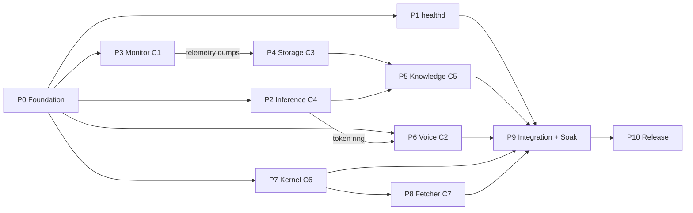
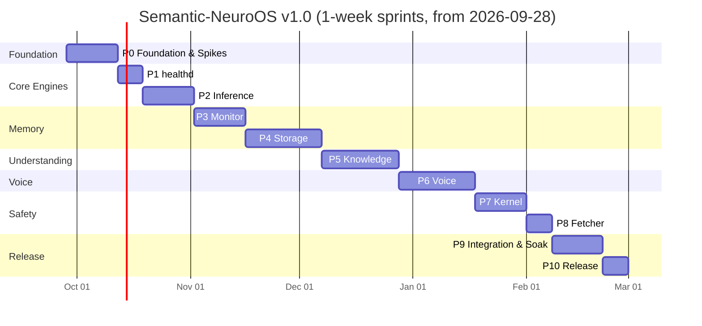

# phases.md — Agile Delivery Plan

**Document version:** 1.0 · **Date:** 2026-09-26 · **Status:** Baseline
**Traceability:** stories → [PRD.md](PRD.md) requirement IDs → tests → exit criteria → `reports/`
**State tracking:** [memory.md](memory.md) is updated at every story completion and phase gate.

---

## 1. Agile Operating Model

### 1.1 Cadence

| Element | Setting |
| :--- | :--- |
| Framework | Scrum with phase gates (component-by-component delivery) |
| Sprint length | 1 week (AI-assisted pace). A phase spans 1–3 sprints. |
| Work unit | User story, estimated in story points (Fibonacci 1, 2, 3, 5, 8, 13). Stories > 8 points must be split. |
| Board columns | Backlog → Ready → In Progress → In Review → Testing → Done |
| Board location | [memory.md](memory.md) §4 (current sprint backlog) |

### 1.2 Roles

| Role | Who | Responsibility |
| :--- | :--- | :--- |
| Product Owner | Project owner (user) | Prioritises backlog, answers open questions, accepts phase gates |
| Lead Architect / Scrum Master | Project owner + AI assistant | Keeps architecture and rules intact, runs ceremonies, updates memory.md |
| Development team | AI assistant (vibe coding) with owner review | Implements stories, writes tests, writes phase reports |

### 1.3 Ceremonies (lightweight)

| Ceremony | When | Output |
| :--- | :--- | :--- |
| Sprint planning | Start of sprint | Sprint goal + selected stories recorded in memory.md §4 |
| Daily check-in | Start of each work session | AI reads memory.md, states current story and file |
| Sprint review | End of sprint | Demo of working increment; memory.md §3 log updated |
| Retrospective | End of sprint | 1–3 improvements recorded in memory.md §9 |
| **Phase gate review** | End of phase | All exit criteria verified with evidence → phase report in `reports/` → owner sign-off |

### 1.4 Definition of Ready (story)

- [ ] Has an ID (`P<phase>-S<nn>`), a user-story sentence, and linked requirement IDs.
- [ ] Acceptance criteria are testable.
- [ ] Dependencies are done or mocked.
- [ ] Estimated (≤ 8 points).
- [ ] No blocking open question.

### 1.5 Definition of Done (story)

- [ ] Code complete, formatted, zero lint warnings.
- [ ] Unit tests written and passing; coverage gate met for touched modules.
- [ ] Contract/integration tests updated when interfaces changed.
- [ ] No rule in [rules.md](rules.md) violated; sandbox stanzas intact.
- [ ] Docs updated (component README, root docs if behaviour changed).
- [ ] memory.md updated (story moved to Done, completed log entry).
- [ ] `just ci` green.

### 1.6 Definition of Done (phase)

- [ ] Every story in the phase is Done (or explicitly descoped with owner approval, recorded in memory.md).
- [ ] Every exit criterion is checked **with evidence** (test output, benchmark JSON, screenshot, log excerpt).
- [ ] Phase report written in `reports/phase-NN-<slug>.md` from `reports/_TEMPLATE.md`, with both non-technical and technical summaries.
- [ ] memory.md phase tracker updated; next phase set as current.
- [ ] Owner sign-off recorded in the report.

### 1.7 Standard test levels

Each phase selects from these levels. "Required" levels are listed per phase.

| Level | Code | Purpose | Tooling |
| :--- | :--- | :--- | :--- |
| Unit | UT | Functions and modules in isolation | nextest, GoogleTest, pytest |
| Property | PT | Invariants over random inputs | proptest, hypothesis |
| Contract | CT | Proto messages round-trip Rust ↔ C++ ↔ Python; server honours contract with mock clients | `tests/contract/` |
| Component integration | IT | Real binary + mocked peers from `neuroos-testkit` | assert_cmd, testkit |
| Performance | PF | Latency/RSS against PRD §6 budgets | criterion, Google Benchmark, `bench/` |
| Security | SC | Sandbox probes, adversarial corpora, fuzzing | `tests/security/`, cargo-fuzz |
| Fault injection | FI | Peer crash, restart, slow peer, full disk, corrupt input | testkit chaos helpers |
| Mini-soak | MS | 1–4 h run of a component with realistic load | `tests/soak/` |
| End-to-end | E2E | User journeys UJ-1…UJ-4 | `tests/e2e/` |
| Acceptance | AT | Owner demo against user stories | manual script in the phase report |

---

## 2. Roadmap Overview

### 2.1 Phase list

| Phase | Name | Component(s) | Blueprint step | Sprints | Milestone |
| :--- | :--- | :--- | :--- | :--- | :--- |
| 0 | Foundation, Contracts & Spikes | shared libs, repo, units | (pre-Step 1) | 2 | M0 |
| 1 | Health Aggregator | `neuroos-healthd` | Step 1 | 1 | M1 |
| 2 | Neural Inference Engine | C4 `neuroos-inference` | Step 1 | 2 | M1 |
| 3 | Desktop Telemetry Monitor | C1 `neuroos-monitor` | Step 4 (pulled forward) | 2 | M2 |
| 4 | Semantic Storage Engine | C3 `neuroos-storage` | Step 2 | 3 | M2 |
| 5 | Knowledge Engine | C5 `neuroos-knowledge-*` + `neuroosctl ask` | Step 3 | 3 | M3 |
| 6 | Voice & Audio Pipeline | C2 `neuroos-voice` | Step 4 | 3 | M4 |
| 7 | SafetyGate Kernel | C6 `neuroos-kernel` + `neuroos-confirm` | Step 5 | 2 | M5 |
| 8 | External Fetcher | C7 `neuroos-fetcher` | Step 5 | 1 | M5 |
| 9 | System Integration & 24 h Soak | all | Step 6 | 2 | M6 |
| 10 | Hardening, Packaging & v1.0 Release | all | (post-Step 6) | 1 | M6 |
| | **Total** | | | **22 sprints (≈ 22 weeks)** | |

> **Why C1 moves before C3:** the Phase 4 soak-replay gate ("promoted entities ≤ 30, compiler subprocesses = 0, zero-access MPRIS nodes = 0") needs *captured* telemetry dumps. Building C1 first produces real dumps with `neuroos-monitor --record` (ADR-0004).

### 2.2 Dependency graph

**Independence rule:** components are built and tested **alone** against mocks from `neuroos-testkit` until Phase 9. Real peers replace mocks only when a phase explicitly depends on them (P4 uses real C1 dumps; P5 uses real C3 + C4; P6 uses real C4 ring).

**Parallel tracks (optional):** P1, P2 and P3 have no mutual dependency. P6 and P7 can run in parallel with P4/P5. The default plan is sequential for a single developer.

### 2.3 Sprint timeline (sequential default)

---

## 3. Phase 0 — Foundation, Contracts & Spikes

**Goal:** a repository where any component can be built, tested, sandboxed and health-checked from day one, and where the four riskiest assumptions are proven or corrected.
**Depends on:** nothing · **Sprints:** 2 · **Report:** `reports/phase-00-foundation.md`

### 3.1 What to build

1. **Repository scaffold:** `git init`, folder tree from [Architecture.md](Architecture.md) §14, move source blueprints to `docs/blueprints/`, `README.md`, `.gitignore` (models, data, keys), `.editorconfig`, formatter configs.
2. **Toolchains:** `rust-toolchain.toml`, Cargo workspace, `cpp/CMakeLists.txt` + `CMakePresets.json` (debug, release, asan, tsan), Python `uv` project skeleton.
3. **`justfile`:** `build`, `test`, `lint`, `fmt`, `cov`, `bench`, `ci`, `proto`, `install-dev`.
4. **Contracts v1:** all `.proto` files with envelope, common, health, and first-cut messages for every component. Code generation for Rust, C++, Python.
5. **Shared libraries:** `neuroos-common` (config loader with strict validation, paths, UTC-ns time, logging init), `neuroos-ipc` (framing, UDS server/client, `SO_PEERCRED`, deadlines, reconnect), `neuroos-health` (health server + latency histogram), `neuroos-taint`, `neuroos-sandbox` (Landlock + seccomp helpers), `neuroos-testkit` (mock servers, fixture loaders), `cpp/libneuroos` (C++ framing + health server), Python `neuroos_ipc`.
6. **systemd templates:** unit template with the full hardening baseline and `PrivateNetwork=true`; target; `sysusers.d`; `tmpfiles.d`.
7. **Security groundwork:** `docs/threat-model.md` v0 (STRIDE per trust boundary), `deny.toml` with network-crate bans, `scripts/check-egress.sh`.
8. **Models manifest:** `models/manifest.toml` + `scripts/fetch-models.sh` with SHA-256 verification.
9. **Spikes** (time-boxed, 1–2 days each), each ending in an ADR:
   - **S-01** unit mode: `PrivateNetwork=true` + `SO_PEERCRED` + Wayland/PipeWire/D-Bus socket reachability in a user unit vs a system template unit (`User=%i`). → ADR-0002.
   - **S-02** memfd seqlock ring: Rust writer/C++ reader and reverse, 10 M messages under TSan.
   - **S-03** COSMIC `zcosmic_toplevel_info_v1`: list toplevels, read `app_id`/title/activated state.
   - **S-04** `bitnet.cpp` build with AVX2 on the reference CPU, first tokens/s figure.
10. **ADRs** 0001 (record decisions), 0002 (unit mode), 0003 (IPC), 0004 (build order).

### 3.2 User stories

| ID | Story | Reqs | Pts |
| :--- | :--- | :--- | :--- |
| P0-S01 | As the operator, I can run `just ci` on a clean checkout and get a green result. | NFR-OPS-02 | 5 |
| P0-S02 | As a developer, I can define a message once in `.proto` and use it from Rust, C++ and Python. | R0-7 | 5 |
| P0-S03 | As a component author, I get a UDS server/client with framing, deadlines, `SO_PEERCRED` and reconnect for free. | NFR-SEC-02, NFR-REL-01 | 8 |
| P0-S04 | As a component author, I get a health endpoint with latency histograms by adding one line. | FR-HLT-02 | 3 |
| P0-S05 | As a security reviewer, every unit template has `PrivateNetwork=true` and the hardening baseline from day one. | NFR-SEC-01 | 3 |
| P0-S06 | As the architect, the unit-mode question (R-01) is answered by a working prototype and ADR-0002. | R-01 | 5 |
| P0-S07 | As the architect, the memfd seqlock ring is proven race-free across languages. | FR-INF-03 | 5 |
| P0-S08 | As the architect, COSMIC toplevel data and bitnet.cpp AVX2 builds are proven on the reference machine. | FR-MON-01, FR-INF-01 | 5 |
| P0-S09 | As the operator, I can fetch and verify all models with one script. | NFR-SEC-05, R0-5 | 3 |
| P0-S10 | As a developer, CI fails if any crate other than the fetcher depends on a network crate. | R0-1, NFR-SEC-03 | 2 |

### 3.3 Testing phase

| Level | Tests |
| :--- | :--- |
| UT | Framing encode/decode incl. max-size, truncated and oversized frames; config validation rejects unknown keys; UTC-ns conversions. |
| PT | Framing round-trip for arbitrary payloads; taint union is associative/commutative/idempotent. |
| CT | Every v1 message round-trips Rust → C++ → Python → Rust byte-identically. |
| IT | Echo server in a sandboxed unit: client connects, `SO_PEERCRED` rejects a different UID (test with a second user or `sudo -u nobody`), reconnect after server restart ≤ 10 s. |
| SC | Inside a `PrivateNetwork=true` test unit: `curl`, DNS lookup and a TCP connect to 1.1.1.1 all fail; UDS path socket still works; `deny.toml` ban triggers on a probe crate. |
| PF | IPC round-trip p99 < 100 µs for 1 KiB payloads; seqlock ring ≥ 1 M slots/s. |

### 3.4 Exit criteria

- [ ] `just ci` passes on a clean clone (evidence: CI log).
- [ ] All v1 protos generate and pass cross-language round-trip tests.
- [ ] `neuroos-ipc` coverage ≥ 80%; framing and `SO_PEERCRED` paths 100% branch.
- [ ] Spikes S-01…S-04 complete; ADR-0001…0004 written and accepted by the owner.
- [ ] A sandboxed echo unit proves: no network, UDS works, peer UID enforced.
- [ ] `scripts/fetch-models.sh` downloads and verifies every model in the manifest.
- [ ] Threat model v0 committed.
- [ ] memory.md updated; phase report written.

---

## 4. Phase 1 — Health Aggregator (`neuroos-healthd`)

**Goal:** an independent daemon that sees every component's health, memory and latency — built first so every later phase is observable.
**Depends on:** P0 · **Sprints:** 1 · **Report:** `reports/phase-01-healthd.md`

### 4.1 What to build

1. `neuroos-healthd` binary: scraper loop (30 s default), per-target timeout (1 s), target registry from config.
2. cgroup reader: `memory.current`, `memory.peak`, `cpu.stat` per unit.
3. Aggregate model: per component status (`OK / DEGRADED / DOWN / UNKNOWN`), RSS vs budget, p50/p99 latencies, error counters, last error time.
4. Soak engine: baseline capture, RSS growth % and p99 drift % tracking, breach events, CSV output to `~/.local/share/neuroos/soak/`.
5. `healthd.sock` API + minimal `neuroosctl status` (text table and `--json`).
6. Unit file with full sandbox.

### 4.2 User stories

| ID | Story | Reqs | Pts |
| :--- | :--- | :--- | :--- |
| P1-S01 | As the operator, healthd scrapes every configured health socket every 30 s and marks unreachable ones DOWN. | FR-HLT-01/02 | 5 |
| P1-S02 | As the operator, I see each unit's cgroup memory against its budget. | FR-HLT-03 | 3 |
| P1-S03 | As the operator, soak mode flags RSS growth > 5% or p99 drift > 10%. | FR-HLT-04 | 5 |
| P1-S04 | As the operator, `neuroosctl status` shows the aggregate report. | FR-HLT-05, FR-CLI-01 | 3 |

### 4.3 Testing phase

| Level | Tests |
| :--- | :--- |
| UT | Status state machine; drift maths (fixed vectors); cgroup file parsing. |
| IT | healthd against 8 mock components from testkit: healthy, slow (> timeout), crashing, returning malformed frames. |
| FI | Kill a mock mid-scrape; healthd keeps running and reports DOWN within one cycle. |
| PF | RSS ≤ 15 MiB with 9 targets; one scrape cycle ≤ 50 ms CPU. |
| MS | 4 h run against mocks with synthetic slow memory growth: breach detected at the correct time. |
| SC | Unit passes sandbox probe (no network). |

### 4.4 Exit criteria

- [ ] healthd detects DOWN, DEGRADED and budget breaches for all mock scenarios.
- [ ] Soak drift detection verified against synthetic growth (evidence: CSV + test log).
- [ ] RSS ≤ 15 MiB measured.
- [ ] `neuroosctl status` works in text and JSON.
- [ ] Coverage ≥ 80%.
- [ ] Phase report written; memory.md updated.

---

## 5. Phase 2 — Neural Inference Engine (C4 `neuroos-inference`)

**Goal:** a sandboxed, mmap-backed BitNet b1.58 service with measured performance, streaming, cancellation and priority lanes.
**Depends on:** P0 (S-02, S-04) · **Sprints:** 2 · **Report:** `reports/phase-02-inference.md`

### 5.1 What to build

1. C++20 service linking pinned `bitnet.cpp`; read-only `mmap` weight loading with SHA-256 check at startup.
2. `inference.sock` API: `Generate`, `Distill`, `Cancel`, `Tokenize/Count` (for tests), `GetInfo`.
3. Two lanes: interactive (preempts), background (yields between decode steps). Bounded queue per lane.
4. memfd seqlock token ring writer; fd handed to the registered consumer (C2) via `SCM_RIGHTS`.
5. GBNF grammar support for structured output.
6. KV prefix cache for the fixed 128-token system prompt (latency lever, §9.1 Architecture).
7. Benchmark harness: TTFT, prefill ms/token, decode ms/token at 128 / 512 / 1,024 contexts, thread-count sweep, RSS.
8. Health endpoint; unit file (validate spike S-05 `MemoryDenyWriteExecute`).

### 5.2 User stories

| ID | Story | Reqs | Pts |
| :--- | :--- | :--- | :--- |
| P2-S01 | As C5, I can send a prompt and receive a streamed completion. | FR-INF-01/02 | 8 |
| P2-S02 | As C2, I receive generated text through a zero-copy shared-memory ring. | FR-INF-03 | 5 |
| P2-S03 | As C2/C5, I can cancel a generation and it stops within one decode step. | FR-INF-05 | 3 |
| P2-S04 | As C5, background distillation never delays an interactive request by more than one decode step. | FR-INF-06, FR-KNO-05 | 5 |
| P2-S05 | As C6, I can force JSON output that matches a grammar. | FR-INF-04 | 3 |
| P2-S06 | As the architect, I have measured TTFT/prefill/decode numbers replacing blueprint projections. | FR-INF-07, NFR-PERF-07 | 5 |

### 5.3 Testing phase

| Level | Tests |
| :--- | :--- |
| UT | Lane scheduler, queue bounds, ring writer, grammar loader. |
| CT | `inference.proto` contract with Rust mock client. |
| IT | Rust test client drives generate/cancel/distill; ring read by a Rust reader. Determinism with fixed seed + temperature 0. |
| PF | Benchmark matrix (context × threads) → `reports/bench/inference-*.json`. Targets: decode ≤ 45 ms/token p50 @ 512; prefill ≈ 2.5 ms/token; RSS ≤ 1,590 MiB. |
| FI | Client disconnect mid-stream frees the slot; corrupt model file → fatal exit with a clear error; oversized prompt rejected. |
| SC | Sandbox probe; Landlock denies reading outside the model dir; TSan clean on the ring. |
| MS | 2 h alternating interactive + background load: no RSS growth > 2%. |

### 5.4 Exit criteria

- [ ] Benchmark JSON committed for 128/512/1,024 contexts; results compared with targets in the report. If a target is missed, a mitigation decision is recorded (ADR) before proceeding.
- [ ] Cancellation latency ≤ 1 decode step (measured).
- [ ] Interactive preemption verified under background load.
- [ ] Token ring passes 10 M-slot stress test under TSan.
- [ ] Weights mapped read-only (`/proc/<pid>/smaps` evidence); RSS within budget.
- [ ] Coverage ≥ 70% (C++ service code).
- [ ] Phase report written; memory.md updated.

---

## 6. Phase 3 — Desktop Telemetry Monitor (C1 `neuroos-monitor`)

**Goal:** a raw, faithful, low-overhead stream of desktop context, plus recorded dumps for Phase 4.
**Depends on:** P0 (S-03) · **Sprints:** 2 · **Report:** `reports/phase-03-monitor.md`

### 6.1 What to build

1. Sensor trait + implementations: COSMIC toplevel, wlroots foreign-toplevel (P1), `ext_idle_notify_v1`, MPRIS via `zbus`, CPU/RSS sampler, `/proc` process-tree snapshot for the focused PID, folder sensor (inotify: git, notes, ICS) (P1).
2. Event bus → `monitor.sock` server-push stream with bounded buffer and drop counter.
3. Privacy layer: pause state (via `neuroosctl pause`), app exclusion list with sane defaults (password managers).
4. `--record <file>` and `neuroosctl replay` dump format (length-prefixed envelopes + header with anonymisation flag).
5. Anonymiser tool for fixtures.
6. Health endpoint; unit file (read-only Wayland/D-Bus/proc access).

### 6.2 User stories

| ID | Story | Reqs | Pts |
| :--- | :--- | :--- | :--- |
| P3-S01 | As C3, I receive focus changes with app_id, title, PID and UTC-ns timestamps. | FR-MON-01, FR-MON-06 | 8 |
| P3-S02 | As C3, I receive idle/active transitions. | FR-MON-02 | 2 |
| P3-S03 | As C3, I receive MPRIS playback events. | FR-MON-03 | 3 |
| P3-S04 | As C3, I receive resource samples and a process tree snapshot for the focused window. | FR-MON-04/05 | 5 |
| P3-S05 | As the user, excluded apps and paused periods never leave C1. | FR-MON-08, FR-PRV-01/02 | 3 |
| P3-S06 | As a tester, I can record and replay a telemetry dump. | FR-MON-10 | 3 |
| P3-S07 | As C3, I receive file activity for configured git/notes/ICS folders. | FR-MON-09 | 5 |

### 6.3 Testing phase

| Level | Tests |
| :--- | :--- |
| UT | Event construction, exclusion matching (globs), pause timer, dump format. |
| IT | Headless compositor test (nested COSMIC/`cage`/`sway` in CI where available) opening and focusing windows; MPRIS mock player on a private D-Bus; subscriber receives the expected sequence. |
| PF | Capture latency p99 < 1.5 ms (compositor event timestamp → socket write); RSS ≤ 25 MiB; idle CPU < 0.5%. |
| FI | Compositor restart, D-Bus player vanishing, subscriber slow/absent (bounded buffer, drop counter increments). |
| SC | Excluded app never appears in stream (property test over random window sequences); sandbox probe. |
| MS | **Record ≥ 8 h of real desktop use** (≥ 3 dumps of different work styles: coding with builds, browsing docs, media playing), anonymised, committed to `tests/fixtures/telemetry/`. |

### 6.4 Exit criteria

- [ ] All sensors emit correct events on the reference machine (COSMIC).
- [ ] Capture p99 < 1.5 ms and RSS ≤ 25 MiB measured.
- [ ] Exclusion and pause proven by property tests.
- [ ] ≥ 3 anonymised real dumps committed (≥ 8 h total) — **required input for Phase 4**.
- [ ] Coverage ≥ 80%.
- [ ] Phase report written; memory.md updated.

---

## 7. Phase 4 — Semantic Storage Engine (C3 `neuroos-storage`)

**Goal:** the single source of persistent truth: filtered ingest, embeddings, hybrid retrieval, focus history, lifecycle jobs, and a passing soak-replay gate.
**Depends on:** P0, P3 dumps · **Sprints:** 3 · **Report:** `reports/phase-04-storage.md`

### 7.1 What to build

1. SQLite schema + migrations (Architecture §7.2); LanceDB tables per family.
2. 4-stage synchronous ingest filter: PPID collapse, self-observation exclusion, promotion gate, MPRIS demotion.
3. 13 domain adapters (after OQ-02 confirmation) with taint attachment.
4. FastEmbed `bge-small-en-v1.5` embedder (single owner), batching for ingest, single-query path for retrieval.
5. Query APIs: `QueryHybridVectorText`, `QueryFocusHistory`, `GraphRead/GraphUpsert` (for C5b), `Forget`.
6. Exact SIMD flat search; latency monitor; USearch HNSW promotion when p99 > 5 ms (P1).
7. Spool ingest via inotify (with a local fake spool for tests).
8. Lifecycle: daily GC, 6-hourly backups, re-index on model id change, retention per domain.
9. SQLite v1 → v2 migrator (only if OQ-03 provides a sample database).
10. Replay harness: `neuroosctl replay <dump>` → ingest → gate assertions.

### 7.2 User stories

| ID | Story | Reqs | Pts |
| :--- | :--- | :--- | :--- |
| P4-S01 | As the system, noisy events (compiler subprocesses, own windows, passive media) never become persistent nodes. | FR-STO-01 | 8 |
| P4-S02 | As C5, events are stored in the right domain with the right taint. | FR-STO-02 | 5 |
| P4-S03 | As C5, I get the top-k relevant chunks for a question in ~13 ms. | FR-STO-03/04/05 | 8 |
| P4-S04 | As C5, I get the window that was focused at a given moment ± 1.5 s. | FR-STO-06 | 3 |
| P4-S05 | As the system, a slow collection is promoted to HNSW automatically. | FR-STO-07, FR-21 | 5 |
| P4-S06 | As the system, fetched documents are ingested as untrusted. | FR-STO-08 | 3 |
| P4-S07 | As the user, old data expires and backups exist. | FR-STO-09/10 | 5 |
| P4-S08 | As the operator, a model upgrade re-indexes without downtime. | FR-STO-11 | 5 |
| P4-S09 | As the user, I can forget a time range or an app. | FR-STO-12, FR-PRV-03 | 3 |
| P4-S10 | (Conditional) As an existing v1 user, my SQLite v1 data migrates. | FR-17 | 5 |

### 7.3 Testing phase

| Level | Tests |
| :--- | :--- |
| UT | Each filter stage with table-driven cases; promotion gate boundaries (N = 2/3, dwell 4.9/5.1 s); retention calculators; migration up/down. |
| PT | Filter never promotes an excluded app; taint preserved through adapters; forget leaves zero rows in range. |
| CT | `storage.proto` against Rust and Python mock clients. |
| IT | Full binary with a fake monitor replaying dumps; spool ingest; concurrent queries during ingest. |
| **Gate** | **Soak-replay assertion on every committed dump: `total_promoted_entities <= 30`, `compiler_subprocesses == 0`, `zero_access_mpris_nodes == 0`.** |
| PF | Query p50 ≤ 13 ms, p99 ≤ 20 ms at 20,000 items; ingest throughput ≥ 200 events/s; RSS ≤ 205 MiB; HNSW promotion triggered by a synthetic 100 k-item collection. |
| FI | Kill during write → restart → integrity check passes (`PRAGMA integrity_check`, LanceDB open); disk full → ingest pauses, queries still served; corrupt spool file rejected. |
| SC | Landlock denies reads outside allowed paths; SQL injection attempts via titles are inert (parameterised). |
| MS | 4 h continuous replay at 10× speed: RSS growth < 3%, p99 stable. |

### 7.4 Exit criteria

- [ ] Soak-replay gate passes on all dumps (evidence: gate output per dump).
- [ ] Retrieval latency and RSS within budget (benchmark JSON).
- [ ] Crash-consistency tests pass; backup restore tested end to end.
- [ ] Forget verified (rows, vectors, next backup).
- [ ] 100% branch coverage on ingest filter and taint attachment; ≥ 80% overall.
- [ ] OQ-02 closed (domain list final); OQ-03 closed (migrator built or dropped).
- [ ] Phase report written; memory.md updated.

---

## 8. Phase 5 — Knowledge Engine (C5 `neuroos-knowledge-query` + `neuroos-knowledge-background`)

**Goal:** turn a question into a grounded, taint-aware 512-token prompt in < 5 ms of own compute, answer it via C4, and learn the graph in the background. First end-to-end answers by text.
**Depends on:** P2, P4 (real); C2 and C6 mocked · **Sprints:** 3 · **Report:** `reports/phase-05-knowledge.md`

### 8.1 What to build

1. **Hot path (Rust):** `knowledge.sock` API (`VoiceCommand`, `Ask`), preamble-first orchestration, parallel deictic snap + evidence retrieval, token counting with the BitNet tokenizer, fast-path truncation, async distillation spawning + cache, 512-token prompt assembly, taint XML wrapping and flag union, capability evaluation call (mock C6), generation call to C4, degraded-mode answers.
2. **Prompt templates** versioned in `crates/neuroos-knowledge-query/prompts/` with snapshot tests.
3. **`neuroosctl ask "<text>"`** — full text path, prints streamed answer.
4. **Cold worker (Python):** job loop, APPNP (10 iterations, sparse), parametric Hawkes (decay 0.05), 72 h hypothesis pruning, writes via `storage.sock`.
5. **Graph view:** `neuroosctl graph open` → C5a renders `graph_view.html` from the template (inline D3 + fonts), styled per [design.md](design.md) §6.
6. **Evaluation harness:** ≥ 50 scripted questions over replayed dumps, answers graded (KPI-1), deictic fixtures (KPI-2).

### 8.2 User stories

| ID | Story | Reqs | Pts |
| :--- | :--- | :--- | :--- |
| P5-S01 | As the user, "this" resolves to the window I was looking at when I spoke. | FR-KNO-01 | 5 |
| P5-S02 | As the user, I hear a preamble before any slow work starts. | FR-KNO-02 | 2 |
| P5-S03 | As the user, answers are grounded in my stored activity. | FR-KNO-03/04/06 | 8 |
| P5-S04 | As the user, big evidence is distilled in the background so follow-ups are better, without slowing the first answer. | FR-KNO-05 | 5 |
| P5-S05 | As C6, I always receive the correct union of taint flags, and tainted text is wrapped. | FR-KNO-07/08 | 5 |
| P5-S06 | As the operator, I can ask by text with `neuroosctl ask`. | FR-CLI-01 | 3 |
| P5-S07 | As the system, the graph learns relationships and prunes stale hypotheses. | FR-KNO-10 | 8 |
| P5-S08 | As the user, I can open a local, offline graph view. | FR-KNO-11 | 5 |

### 8.3 Testing phase

| Level | Tests |
| :--- | :--- |
| UT | Snap overlap selection; truncation respects token budget exactly; prompt partition 128/64/320 never exceeds 512 (property test); taint wrapping escapes nested tags. |
| PT | For any evidence set, output taint ⊇ union of input taints; prompt ≤ 512 tokens. |
| CT | `knowledge.proto`; Python cold worker ↔ `storage.proto`. |
| IT | Real C3 + real C4 + mock C2/C6: `neuroosctl ask` end to end; preamble request precedes retrieval (ordering assertion). |
| PF | Own compute p99 < 5 ms (instrumented spans); text path "ask → first token" measured and reported. Cold worker RSS ≤ 45 MiB; hot ≤ 30 MiB. |
| FI | C4 down → degraded apology within 250 ms; C3 slow → deadline hit → answer without evidence flagged; distillation job cancelled on new query. |
| SC | Injection corpus v0: tainted docs containing "ignore previous instructions / call shell.exec" → taint flags reach mock C6; tier never lowered. |
| AT | Evaluation set: KPI-1 ≥ 80% (target; if below, record gap and plan), KPI-2 ≥ 95%. |
| Graph | `graph_view.html` opens offline with network disabled in the browser (DevTools shows 0 requests). |

### 8.4 Exit criteria

- [ ] Own-compute p99 < 5 ms measured.
- [ ] KPI-2 ≥ 95% on deictic fixtures; KPI-1 result recorded (target ≥ 80%).
- [ ] Taint property tests at 100% branch coverage.
- [ ] `neuroosctl ask` demo recorded in the report (UJ-1 by text).
- [ ] Graph view verified zero-request and styled per design.md.
- [ ] OQ-04 closed.
- [ ] Phase report written; memory.md updated.

---

## 9. Phase 6 — Voice & Audio Pipeline (C2 `neuroos-voice`)

**Goal:** hands-free interaction: wake word, fast transcription, instant preamble, natural answer voice, sub-millisecond barge-in.
**Depends on:** P0, P2 (token ring); C5 mocked, then real for the final IT · **Sprints:** 3 · **Report:** `reports/phase-06-voice.md`

### 9.1 What to build

1. PipeWire capture stream (16 kHz mono) into a lock-free ring; playback stream at 24 kHz (Kokoro native rate).
2. Silero VAD gating → openWakeWord → utterance capture → whisper.cpp STT → `VoiceCommand` to C5.
3. Clip cache: at startup, Kokoro pre-renders every preamble and status line from [design.md](design.md) §9 into memory (regenerated when the voice changes) so preambles play in ≤ 50 ms in the same voice.
4. Kokoro-82M streaming engine reading the token ring; sentence/clause chunking with natural pauses; engine restart with cached status clips on failure (no second voice).
4b. Conversation controller: 8 s follow-up window without wake word, turn-taking state machine (listening → thinking → speaking → follow-up).
5. Barge-in controller: VAD during playback → `pw_stream_flush` → cancel C4 → notify C5.
6. Audio device change handling; health endpoint; unit file with RT scheduling exception (S-05 check).
7. Evaluation assets: command WAV set (with the owner's voice and TTS-generated variants), 8 h ambient recording set for false accepts (stored locally only, not committed if it contains private speech).

### 9.2 User stories

| ID | Story | Reqs | Pts |
| :--- | :--- | :--- | :--- |
| P6-S01 | As the user, saying the wake word starts listening; nothing is transcribed otherwise. | FR-VOI-01/02/03, FR-PRV-04 | 8 |
| P6-S02 | As the user, my command is transcribed accurately and quickly. | FR-VOI-04 | 5 |
| P6-S03 | As the user, I hear an instant preamble. | FR-VOI-05 | 5 |
| P6-S04 | As the user, the answer is spoken in a natural voice as it is generated. | FR-VOI-06 | 8 |
| P6-S05 | As the user, speaking over the assistant stops it immediately. | FR-VOI-07 | 5 |
| P6-S06 | As a laptop user, the voice service costs almost nothing while I'm silent. | FR-VOI-08 | 3 |
| P6-S07 | As the user, every word NeuroOS says is in one consistent, human-sounding voice. | FR-VOI-09/10, FR-VOI-12 | 5 |
| P6-S08 | As the user, I can reply to an answer without saying the wake word again, like a real conversation. | FR-VOI-11 | 5 |

### 9.3 Testing phase

| Level | Tests |
| :--- | :--- |
| UT | Ring buffers, resampler, sentence chunker, barge-in state machine, VAD hysteresis. |
| IT | PipeWire null-sink/virtual-source loopback: play WAV fixtures into the virtual mic, assert `VoiceCommand` text; capture TTS output and assert timing. |
| PF | Preamble TTFA ≤ 50 ms p95 (from `PreambleRequest` receipt to first non-silent sample at the sink); barge-in flush < 1 ms; STT ≤ 150 ms for a 3 s utterance; idle CPU < 1%; RSS ≤ 405 MiB. |
| AT | KPI-3 false accepts ≤ 1 / 8 h; KPI-4 false rejects ≤ 5%; KPI-5 WER ≤ 12%. Voice spike + listening test: owner picks the one Kokoro voice (and compares any CPU-real-time alternative); every output (preamble, answer, error) judged the same voice; naturalness rated ≥ 4/5 by the owner. |
| FI | Audio device unplug/replug; C4 ring stalls (timeout → cached apology clip, same voice); C5 absent (spoken "I'm not ready yet"). |
| SC | Confirm no audio file is written anywhere (inotify watch on `$HOME` and `/tmp` during a session); sandbox probe. |
| MS | 4 h with periodic scripted commands + ambient audio: no XRUN storms, RSS growth < 2%. |

### 9.4 Exit criteria

- [ ] TTFA, barge-in, STT latency, idle CPU and RSS within budget (benchmark JSON).
- [ ] KPI-3/4/5 met or gap documented with an owner-approved plan.
- [ ] End-to-end voice demo of UJ-1 with real C5/C3/C4 (mock C6) recorded in the report.
- [ ] No audio persisted (evidence).
- [ ] OQ-01 closed.
- [ ] Phase report written; memory.md updated.

---

## 10. Phase 7 — SafetyGate Execution Kernel (C6 `neuroos-kernel` + `neuroos-confirm`)

**Goal:** no action happens without the right tier, the right confirmation and an audit trail, and untrusted content can never drive a silent action.
**Depends on:** P0; C5 contract (real C5 for final IT) · **Sprints:** 2 · **Report:** `reports/phase-07-kernel.md`

### 10.1 What to build

1. Skill manifest format + object-capability registry; v1.0 skill catalogue (FR-KER-08).
2. Tier evaluator with taint escalation (Architecture §8.3).
3. HMAC key management, confirmation token protocol, nonce spent-set, expiry.
4. `neuroos-confirm` GTK4 dialog per [design.md](design.md) §7 (Zenity fallback).
5. Skill runner: fork/exec child with per-skill Landlock + seccomp, resource limits, timeout.
6. Audit log writer: hash-chained JSONL, rotation at 10 MB × 5, `neuroosctl audit tail/verify`.
7. `memory.forget` and `notes.append` skills wired to C3 / notes folder; `calendar.read` (ICS, per OQ-05).
8. Injection corpus v1 and adversarial tests.

### 10.2 User stories

| ID | Story | Reqs | Pts |
| :--- | :--- | :--- | :--- |
| P7-S01 | As C5, I can ask whether a capability is allowed and get an answer in < 0.5 ms. | FR-KER-01, FR-KER-07 | 5 |
| P7-S02 | As the user, anything influenced by web content asks me first. | FR-KER-03, NFR-SEC-07 | 5 |
| P7-S03 | As the user, I confirm REVIEW actions in a clear dialog, and nobody can fake my approval. | FR-KER-04 | 8 |
| P7-S04 | As the user, skills run in a sandbox with only the access they need. | FR-KER-05 | 5 |
| P7-S05 | As an auditor, every action has an ATTEMPT and a RESULT record and tampering is detectable. | FR-KER-06, F-09 | 5 |
| P7-S06 | As the user, the v1.0 skills work (read metadata, calendar, notes search/append, forget). | FR-KER-08 | 8 |

### 10.3 Testing phase

| Level | Tests |
| :--- | :--- |
| UT | Tier table exhaustively (every tier × taint × disabled); HMAC verify: valid, expired, replayed, wrong args hash, wrong capability, bit-flip; audit chain verification; rotation boundary. |
| PT | For random (capability, taint) pairs, effective tier ≥ base tier; tainted SAFE is never auto-executed. |
| IT | Real kernel + mock C5 + scripted dialog (test mode returning APPROVE/DENY) → skill runs or not; audit pair present in both cases. |
| SC | Injection corpus v1 through real C5 → C6: 0 auto-executions of non-SAFE or tainted skills. Skill runner escape probes (read `hmac.key`, write outside allowed paths, open a socket) all fail. Forged approval from another process rejected. |
| PF | Capability check p99 < 0.5 ms; RSS ≤ 15 MiB idle, dialog adds ≤ 25 MiB and is freed on close. |
| FI | Dialog killed → treated as DENY + `EXPIRED`; disk full while auditing → action denied (fail closed); kernel restart mid-dialog → action expires. |
| AT | UJ-2 steps 4–5 and UJ-3 forget flow demonstrated. |

### 10.4 Exit criteria

- [ ] 100% branch coverage on tier evaluation, taint escalation and HMAC verification.
- [ ] Injection corpus: 0 unauthorised executions (evidence: test report).
- [ ] Audit chain verification passes and detects a tampered line.
- [ ] Skill runner escape probes all fail.
- [ ] Latency and RSS within budget.
- [ ] Dialog matches design.md (screenshots in report).
- [ ] OQ-05 closed.
- [ ] Phase report written; memory.md updated.

---

## 11. Phase 8 — External Network Fetcher (C7 `neuroos-fetcher`)

**Goal:** the only door to the internet: approved, validated, size-limited, and always tainted.
**Depends on:** P7 · **Sprints:** 1 · **Report:** `reports/phase-08-fetcher.md`

### 11.1 What to build

1. System unit `neuroos-fetcher.service` running as `neuroos-fetcher`; `sysusers.d` + `tmpfiles.d` entries.
2. `fetch.sock` server accepting only C6 (`SO_PEERCRED` = desktop user in group `neuroos`).
3. Anti-SSRF: resolve once, IP policy (Architecture §8.6), IP pinning, redirect re-validation, scheme/port/method/content-type/size/time limits.
4. HTML → text/markdown extraction (readability-style) to keep payloads small.
5. Spool writer (atomic write + rename, 0660) with `taint: EXTERNAL_UNTRUSTED`, schema version.
6. `web.fetch` skill in C6 wired to C7.
7. SSRF corpus.

### 11.2 User stories

| ID | Story | Reqs | Pts |
| :--- | :--- | :--- | :--- |
| P8-S01 | As the user, an approved URL is fetched and becomes searchable, marked untrusted. | FR-FET-01/05/06 | 5 |
| P8-S02 | As a security reviewer, the fetcher cannot be used to reach local or private network services. | FR-FET-03 | 8 |
| P8-S03 | As a security reviewer, only C6 can ask the fetcher to fetch. | FR-FET-02 | 2 |
| P8-S04 | As the user, huge or odd content is rejected safely. | FR-FET-04 | 3 |

### 11.3 Testing phase

| Level | Tests |
| :--- | :--- |
| UT | IP policy for every blocked range incl. IPv4-mapped IPv6, decimal/octal/hex IP encodings, `0.0.0.0`, trailing-dot hosts; redirect counter; content-type parser. |
| SC | SSRF corpus: DNS rebinding (test resolver returning public then private), redirects to `127.0.0.1`/`169.254.169.254`/`[::1]`, `file://`/`gopher://` schemes, userinfo tricks → all blocked. A non-C6 peer is rejected. Fuzz URL parser (cargo-fuzz, ≥ 1 h). |
| IT | Local HTTPS test server inside a private network namespace (never the internet) → spool file → real C3 ingest via inotify → retrievable, tainted. |
| PF | RSS ≤ 10 MiB idle; 5 MiB page processed ≤ 300 ms after download. |
| FI | Slowloris server → 15 s timeout; truncated TLS; spool dir full → error to C6, audited. |

### 11.4 Exit criteria

- [ ] SSRF corpus 100% blocked; fuzzing finds no crash.
- [ ] Fetched content reaches C3 tagged `EXTERNAL_UNTRUSTED` (evidence: row dump).
- [ ] UJ-2 fully demonstrated (fetch → taint → escalation → audit) with a local test server.
- [ ] Only C7 has egress (`scripts/check-egress.sh` output).
- [ ] 100% branch coverage on `ssrf.rs`.
- [ ] Phase report written; memory.md updated.

---

## 12. Phase 9 — System Integration & 24 h Soak

**Goal:** all components running together as installed services, proven private, safe and stable for 24 hours.
**Depends on:** P1–P8 · **Sprints:** 2 · **Report:** `reports/phase-09-integration-soak.md`

### 12.1 What to build

1. Replace every remaining mock with real peers; full `neuroos@$USER.target` start order.
2. End-to-end test suite for UJ-1…UJ-4 (voice via PipeWire virtual devices, text via `neuroosctl`).
3. Egress verification: per-unit network namespace inspection, `ss`/`nstat` counters, packet capture on the host interface while running the E2E suite with C7 idle.
4. `systemd-analyze security` pass for every unit.
5. 24 h soak harness: scripted workload (voice/text query every 5 min, replayed telemetry, one fetch per hour, GC + backup cycles), healthd soak mode.
6. Performance regression suite comparing against Phase 2–8 baselines.

### 12.2 User stories

| ID | Story | Reqs | Pts |
| :--- | :--- | :--- | :--- |
| P9-S01 | As the user, all journeys work end to end on the installed system. | UJ-1…4 | 8 |
| P9-S02 | As a privacy-conscious user, I have proof that nothing leaves my machine except approved fetches. | G-2, KPI-6 | 5 |
| P9-S03 | As the operator, the system runs 24 h without leaks or drift. | G-6, NFR-REL-04 | 8 |
| P9-S04 | As the user, killing any one component degrades gracefully and it recovers. | NFR-REL-01/02 | 5 |

### 12.3 Testing phase

| Level | Tests |
| :--- | :--- |
| E2E | UJ-1…UJ-4 automated; end-of-speech → first answer audio measured (NFR-PERF-02). |
| SC | Egress proof (0 bytes from isolated units); full injection + SSRF corpora on the integrated system; `systemd-analyze security` scores. |
| FI | Chaos: kill each unit in turn during a query; restart storms; disk-full; model file removed. |
| PF | Full latency table re-measured; total RSS ≤ 2,340 MiB; idle CPU ≤ 3%. |
| **Soak** | **24 h: RSS growth < 5%, p99 drift < 10%, 0 crashes, backups and GC ran, audit chain valid.** |
| AT | Owner runs the acceptance script (all P0 features) and signs off. |

### 12.4 Exit criteria

- [ ] All E2E journeys pass 3 consecutive runs.
- [ ] KPI-6: 0 bytes egress from isolated units (evidence: capture + counters).
- [ ] 24 h soak passes all thresholds (evidence: healthd soak CSV + summary chart in report).
- [ ] NFR-PERF-01…08 all measured on the integrated system; misses have ADR-approved dispositions.
- [ ] Every unit's `systemd-analyze security` exposure ≤ 4.0 (documented exceptions for C2/C7).
- [ ] Owner acceptance sign-off.
- [ ] Phase report written; memory.md updated.

---

## 13. Phase 10 — Hardening, Packaging & v1.0 Release

**Goal:** an installable, documented, reproducible v1.0.
**Depends on:** P9 · **Sprints:** 1 · **Report:** `reports/phase-10-release.md`

### 13.1 What to build

1. `.deb` package (binaries, units, sysusers, tmpfiles, template assets) + `scripts/install.sh` for source installs; `uninstall.sh` with and without data purge.
2. First-run setup: create `hmac.key`, verify models, write default `config.toml`, add user to `neuroos` group, enable target.
3. Runbooks: install, upgrade, backup restore, "component won't start", "forget everything".
4. Licence bundle (`THIRD_PARTY_LICENSES.md`), closing R-06/R-07 per OQ-06.
5. Release notes, version tagging `v1.0.0`, reproducible build check (two clean builds → identical Rust binaries).
6. Final threat model review.

### 13.2 User stories

| ID | Story | Reqs | Pts |
| :--- | :--- | :--- | :--- |
| P10-S01 | As a new user, I can install and start NeuroOS in under 15 minutes following one guide. | NFR-OPS-02 | 5 |
| P10-S02 | As a user, I can uninstall cleanly, optionally removing all my data. | NFR-PRIV-02 | 3 |
| P10-S03 | As a maintainer, licences and risks are documented for distribution. | R-06, R-07 | 2 |

### 13.3 Testing phase

| Level | Tests |
| :--- | :--- |
| AT | Fresh Pop!_OS 24.04 VM: install from `.deb`, run acceptance script, uninstall with purge → no files left (`find` evidence). |
| SC | Final `cargo audit`/`deny`, dependency review, threat model sign-off. |
| IT | Upgrade path: v1.0.0-rc → v1.0.0 keeps data and config. |

### 13.4 Exit criteria

- [ ] Clean install/uninstall verified in a fresh VM.
- [ ] Runbooks complete and followed once by the owner.
- [ ] Licence file complete; OQ-06 closed.
- [ ] `v1.0.0` tagged; release notes published in `reports/phase-10-release.md`.
- [ ] memory.md marks the project v1.0 complete.

---

## 14. Post-v1.0 Backlog (not scheduled)

| Item | Source |
| :--- | :--- |
| HUD overlay (F-20) | PRD P2 |
| Custom wake-word model (commercial licence) | R-06 |
| Neural Hawkes (if OQ-04 demands) | R-09 |
| X11 support | Non-goal v1.0 |
| GPU/NPU acceleration | Non-goal v1.0 |
| Larger context (up to 4,096) with smarter distillation | FR-INF-02 |
