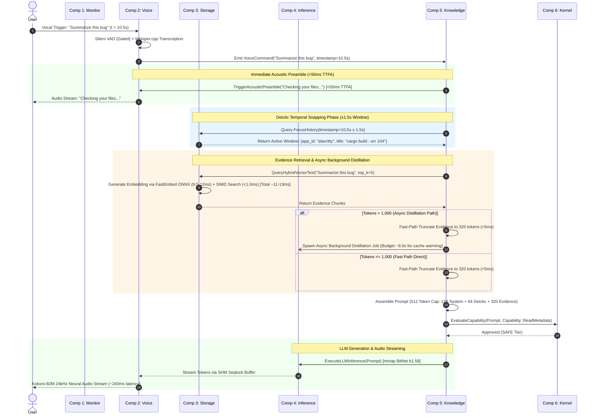
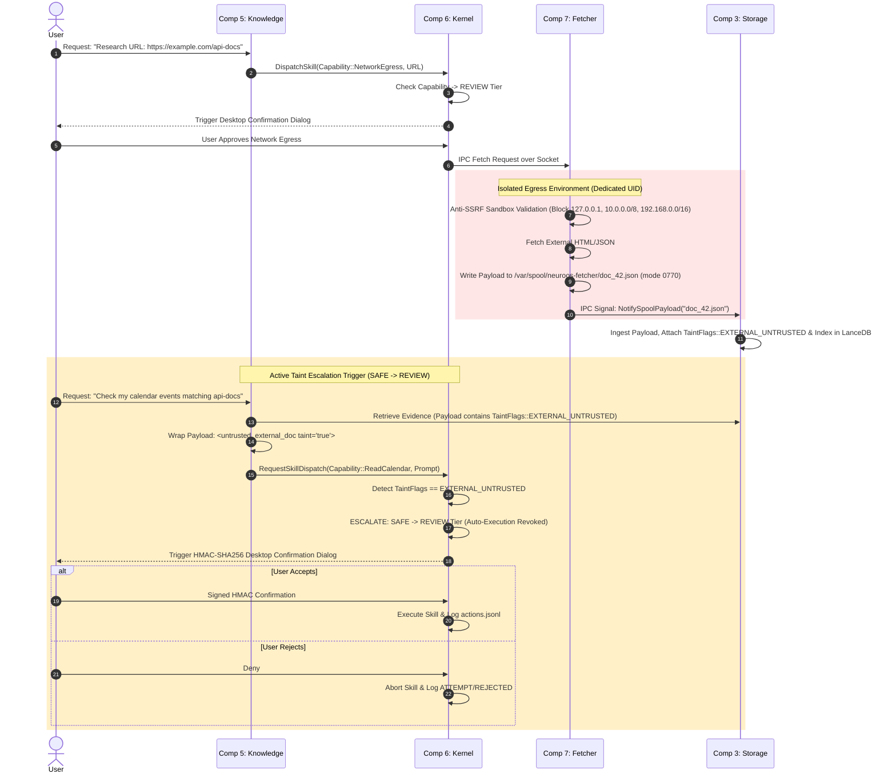
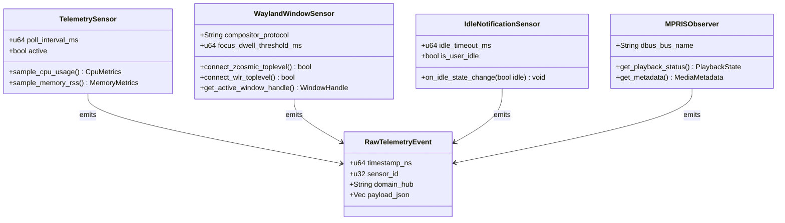
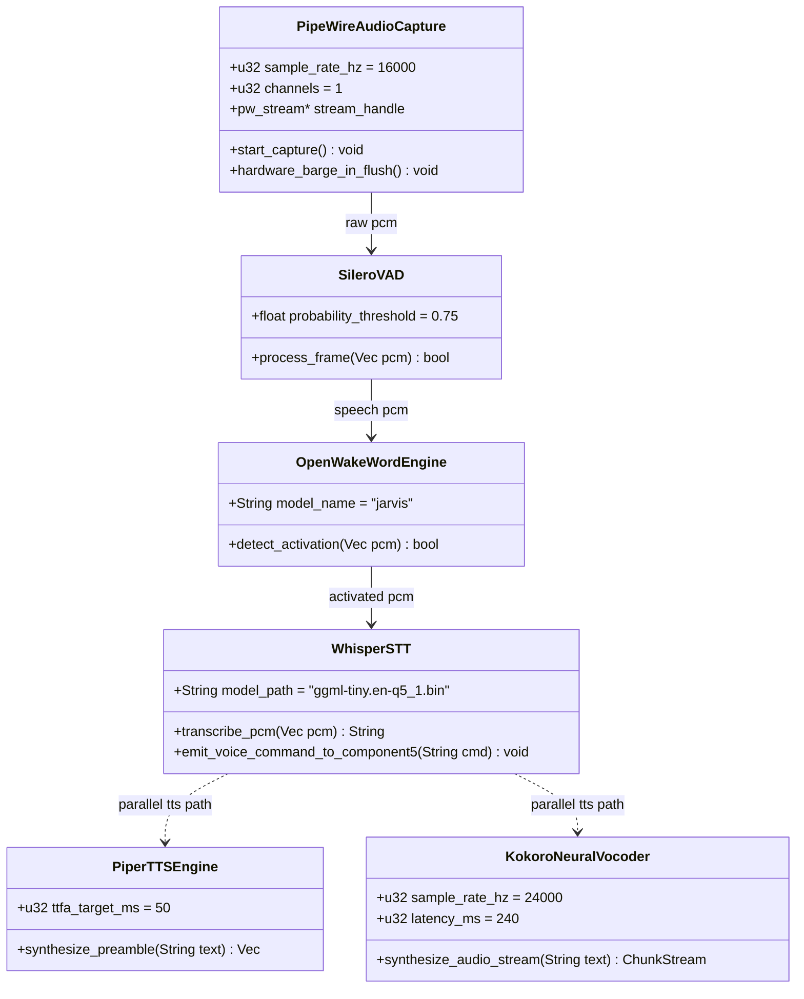
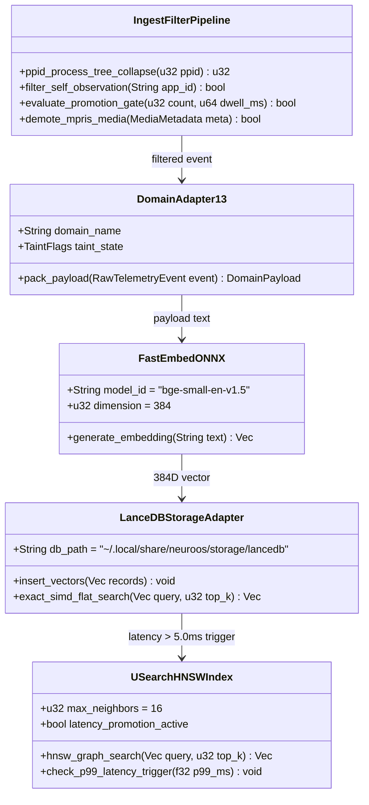
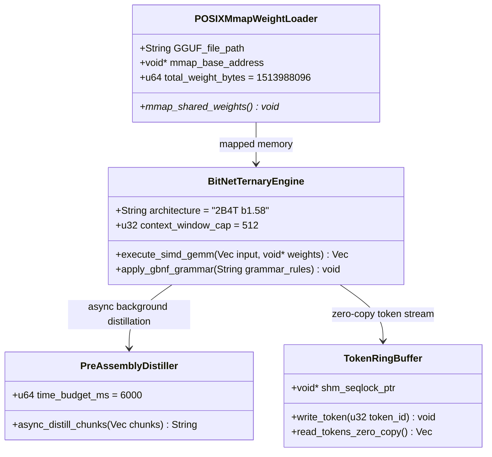
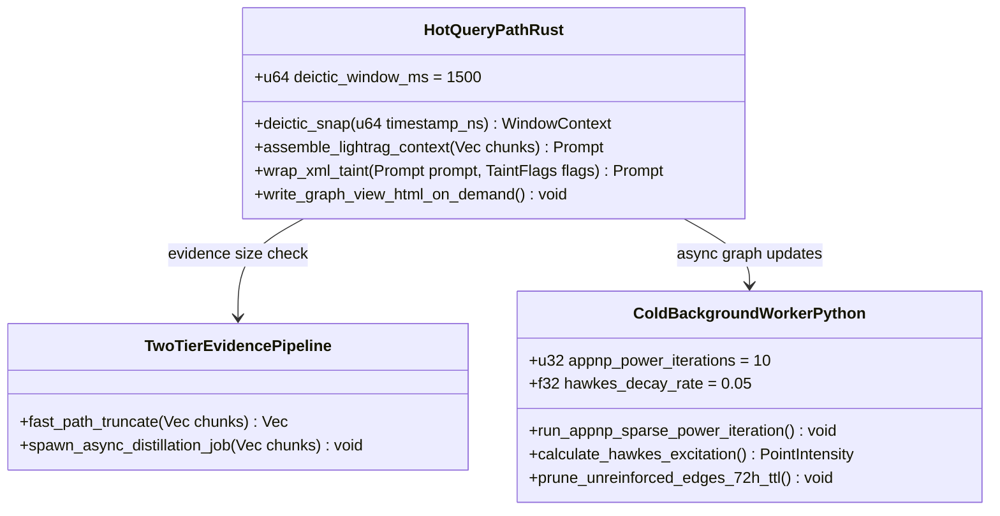
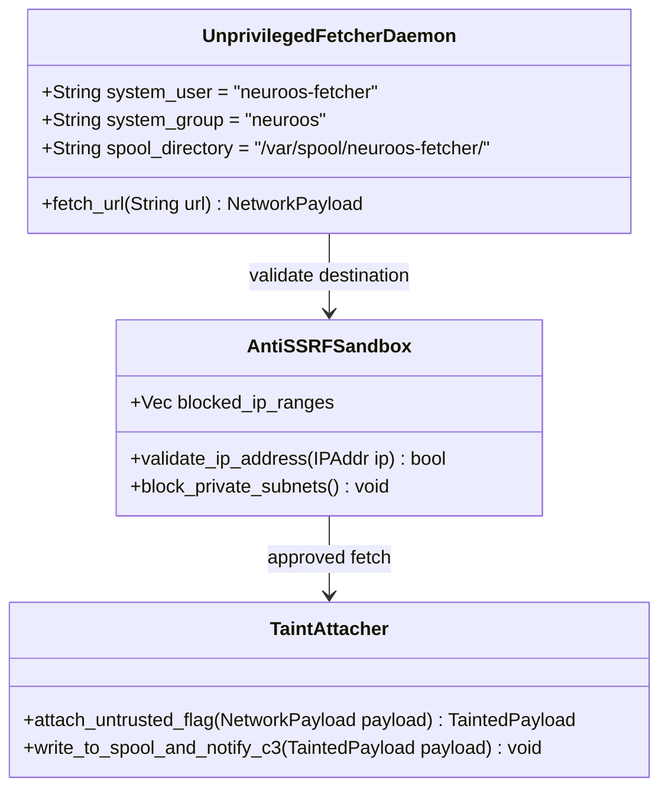
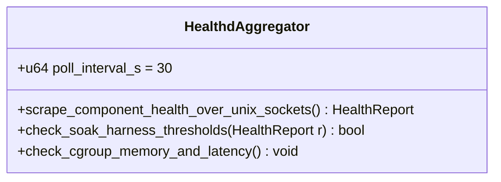
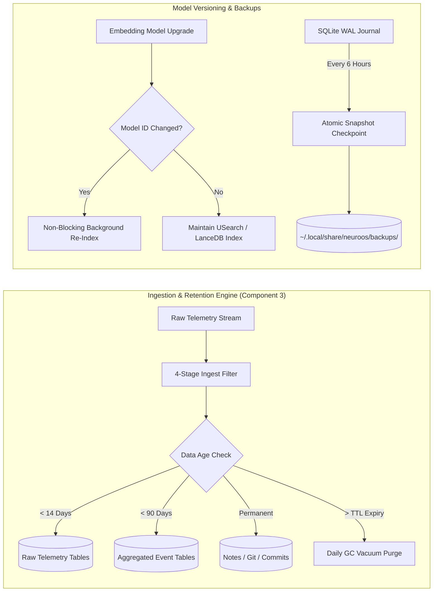

# Semantic-NeuroOS: Full System Implementation & Engineering Architecture Blueprint
## Visual Architectural Design, Component Class Diagrams, and Interactive Workflows

**Document Title**: Complete Implementation Specification for Semantic-NeuroOS  
**Version**: 3.2 (Production Engineering Release: Modular Architecture & Semantic Matrix Integration)  
**Date**: September 2026  
**Security Model**: Airgapped Zero-Egress Kernel (`PrivateNetwork=true`) + Landlock LSM + Capabilities  

---

## Executive Architectural Map

```
+-----------------------------------------------------------------------------------------------------------------------------------+
|                                                  SEMANTIC-NEUROOS SYSTEM BUS                                                      |
|                             (Unix Domain Sockets & POSIX SHM Seqlock — Isolated Loopback Fabric)                                  |
+-----------------------------------------------------------------------------------------------------------------------------------+
        |               |               |               |               |               |               |               |
        v               v               v               v               v               v               v               v
+---------------+ +---------------+ +---------------+ +---------------+ +---------------+ +---------------+ +---------------+ +---------------+
|  COMPONENT 1  | |  COMPONENT 2  | |  COMPONENT 3  | |  COMPONENT 4  | |  COMPONENT 5  | |  COMPONENT 6  | |  COMPONENT 7  | | DIAGNOSTICS   |
|   Desktop     | |   Voice &     | |   Semantic    | |   Neural      | |   Data        | |   SafetyGate  | |   External    | |   Health      |
|   Monitor     | |   Audio       | |   Storage     | |   Inference   | |   Refinement  | |   Execution   | |   Fetcher     | |   Aggregator  |
|   Telemetry   | |   Pipeline    | |   Engine &    | |   Engine      | |   Knowledge   | |   Kernel &    | |   Spool       | |   Daemon      |
|               | |               | |   Ingest      | |               | |   Engine      | |   Registry    | |               | |               |
| [neuroos-     | | [neuroos-     | | [neuroos-     | | [neuroos-     | | [neuroos-     | | [neuroos-     | | [neuroos-     | | [neuroos-     |
|  monitor]     | |  voice]       | |  storage]     | |  inference]   | |  knowledge]   | |  kernel]      | |  fetcher]     | |  healthd]     |
+---------------+ +---------------+ +---------------+ +---------------+ +---------------+ +---------------+ +---------------+ +---------------+
  UID: $USER        UID: $USER        UID: $USER        UID: $USER        UID: $USER        UID: $USER        UID: fetcher (sys) UID: $USER
  Net: Isolated     Net: Isolated     Net: Isolated     Net: Isolated     Net: Isolated     Net: Isolated     Net: EGRESS ALLOW Net: Isolated
  RAM: ~25 MiB      RAM: ~485 MiB     RAM: ~205 MiB     RAM: ~1,590 MiB   RAM: ~75 MiB      RAM: ~15 MiB      RAM: ~10 MiB      RAM: ~15 MiB
  Path: N/A         Path: Audio/PCM   Path: ~/.local    Path: mmap GGUF   Path: ~/.local    Path: actions.j   Path: /var/spool/ Path: Unix Socket
                                            /share/storage  + KV Cache          /graph_view.html  sonl              fetcher/          Scraper
        |               |               |               |               |               |               |               |
        +---------------+---------------+------- Systemd PrivateNetwork=true Sandbox ---+---------------+---------------+
                                                (Components 1-6 & Healthd physically blocked)                    v
                                                                                                +---------------+
                                                                                                | Outer Web /   |
                                                                                                | External Net  |
                                                                                                +---------------+
```

> **System Footprint Summary**: Total active memory footprint is **~2,420 MiB RSS** (~2.42 GB). On resource-constrained systems, omitting Kokoro-82M neural vocoding drops footprint to **~2,120 MiB RSS** (~2.12 GB), with Piper ONNX handling TTS directly.

---

## 1. High-Level System Sequence & Workflow Diagrams

### 1.1 Query Execution & Deictic Temporal Snapping Flow



---

### 1.2 Web Fetcher & Active Taint Escalation Flow



---

## 2. Component Architecture & Class Diagrams

```
+-------------------------------------------------------------------------------------------------------------------+
|                                       COMPONENT CLASS INTERCONNECTION MATRIX                                      |
|                                                                                                                   |
|  +-------------------------+      Events       +-------------------------+      Vectors      +-----------------+  |
|  |   Component 1: Monitor  | ----------------> |   Component 3: Storage  | <---------------> | Comp 4: Infer.  |  |
|  | (TelemetrySensors,      |  (RawTelemetry)   | (IngestPipeline,        |   (mmap GGUF)     | (BitNetEngine,  |  |
|  |  WindowFocusHistory)    |                   |  FastEmbed, LanceDB)    |                   |  TokenBuffer)   |  |
|  +-------------------------+                   +-------------------------+                   +-----------------+  |
|               |                                             ^                                         ^           |
|               | Window Focus History                        | Query Text -> Evidence                  | Inferences|
|               v                                             v                                         |           |
|  +-----------------------------------------------------------------------+                            |           |
|  |                         Component 5: Knowledge                        | ---------------------------+           |
|  |  (DeicticSnapper, TwoTierEvidencePipeline, LightRAGContextAssembler)  |                                        |
|  +-----------------------------------------------------------------------+                                        |
|               ^                                             |                                                     |
|               | Voice Commands                              | Prepared Prompt + Taint Flags                       |
|               |                                             v                                                     |
|  +-------------------------+                   +-------------------------+                   +-----------------+  |
|  |   Component 2: Voice    |                   |   Component 6: Kernel   | ----------------> | Comp 7: Fetcher |  |
|  | (SileroVAD, WhisperSTT, |                   | (SafetyGate, Capability,|  (Spool Command)  | (AntiSSRF,      |  |
|  |  PiperTTS, Kokoro24k)   |                   |  AuditLog, SkillReg)    |                   |  TaintAttacher) |  |
|  +-------------------------+                   +-------------------------+                   +-----------------+  |
|                                                                                                                   |
|  +-------------------------------------------------------------------------------------------------------------+  |
|  |                                  Diagnostics: Independent neuroos-healthd                                   |  |
|  |                           (Scrapes /health endpoints across all components)                                 |  |
|  +-------------------------------------------------------------------------------------------------------------+  |
+-------------------------------------------------------------------------------------------------------------------+
```

---

### 2.1 Component 1: Desktop Telemetry & System Monitoring (`neuroos-monitor`)



> **Component 1 Key Notes**:
> - **UID/GID**: Runs as local `$USER` (no root required).
> - **Isolation**: Enforced via systemd `PrivateNetwork=true` & Landlock read-only access to `/proc` and Wayland sockets.
> - **Decoupling**: Pure event generator. Does NOT judge or filter data—emits raw events over Unix Socket (`/run/user/$UID/neuroos/monitor.sock`).

---

### 2.2 Component 2: Voice, Audio & Speech Pipeline (`neuroos-voice`)



> **Component 2 Key Notes**:
> - **VAD CPU Gating**: Silero VAD runs continuously on incoming PipeWire PCM frames to gate CPU usage; openWakeWord executes strictly when active speech is detected (< 1% idle CPU).
> - **Audio Barge-In**: Native PipeWire `pw_stream_flush` drops hardware audio buffers in **< 1 ms** upon speech detection.
> - **Memory Allocation**: ~485 MiB RSS total (Silero VAD ~15MB + openWakeWord ~10MB + Whisper ~80MB + Piper ~80MB + Kokoro ~300MB).
> - **Latency Masking**: Piper ONNX synthesizes instant preambles ("Checking...") in **< 50 ms TTFA**, masking Kokoro's 240 ms vocoder stream.

---

### 2.3 Component 3: Semantic Matrix Autonomous Storage Engine (`neuroos-storage`)



> **Component 3 Key Notes**:
> - **Single FastEmbed Owner**: Component 3 owns the FastEmbed ONNX model (~120 MiB RSS). C5 passes query text to C3; C3 generates the embedding locally (9.5-12ms) and runs SIMD search (<1.0ms), returning evidence chunks in ~11-13ms total.
> - **Ingest Execution**: Synchronous 4-stage filter runs in Rust inside C3 before storage.
> - **Latency-Driven Indexing**: Flat SIMD dot-product search handles up to 20,000 items. Promotes to USearch HNSW graph **strictly when p99 latency exceeds 5.0 ms**.

---

### 2.4 Component 4: Neural Inference Engine (`neuroos-inference`)



> **Component 4 Key Notes**:
> - **Zero-Copy Memory**: Single physical RAM allocation (~1.41 GiB) mapped across processes via `mmap`.
> - **Context Cap Partition**: Default 512 tokens (128 System + 64 Deictic + 320 Evidence).
> - **Async Cache Warming Distillation**: Large evidence (>1,000 tokens) distilled in the background (~6.0s budget @ 2.5ms/token) to warm cache without blocking fast-path query execution.

---

### 2.5 Component 5: Data Refinement & Knowledge Engine (`neuroos-knowledge`)



> **Component 5 Key Notes**:
> - **Hot/Cold Process Split**: Real-time queries run in native Rust (`neuroos-knowledge-query`, < 5 ms). Background GNN/Hawkes iterations run in Python (`neuroos-knowledge-background`).
> - **Deictic Snapping**: Resolves ambiguous words ("this", "it") using a **±1.5-second temporal window** against Component 3's focus history.
> - **Graph Inspection**: Writes a standalone single-file D3 visualization to `~/.local/share/neuroos/graph_view.html` on demand.

---

### 2.6 Component 6: SafetyGate & Execution Kernel (`neuroos-kernel`)

```mermaid
classDiagram
    class ObjectCapabilityRegistry {
        +HashMap<SkillID, Capability> skill_table
        +register_skill(SkillID id, Capability cap) void
        +lookup_capability(SkillID id) Capability
    }

    class SafetyGateFirewall {
        +evaluate_tier(Capability cap, TaintFlags taint) SafetyTier
        +escalate_tainted_context(SafetyTier tier) SafetyTier
    }

    class LandlockLSMEnforcer {
        +apply_landlock_ruleset(Vec<Path> rw_paths) void
        +apply_seccomp_syscall_filter() void
    }

    class AuditLogManager {
        +String log_path = "~/.local/share/neuroos/actions.jsonl"
        +u64 max_bytes = 10485760
        +log_attempt_and_result(ActionAttempt a, ActionResult r) void
        +rotate_logs() void
    }

    ObjectCapabilityRegistry --> SafetyGateFirewall : capability check
    SafetyGateFirewall --> LandlockLSMEnforcer : sandbox execution
    SafetyGateFirewall --> AuditLogManager : record JSONL
```

> **Component 6 Key Notes**:
> - **Active Taint Escalation**: External untrusted web data **promotes SAFE skills (e.g. `Capability::ReadCalendar`) to REVIEW tier**, revoking auto-execution and requiring an HMAC confirmation popup.
> - **Transient Dialog Budget**: GTK/Zenity HMAC confirmation dialogs allocate **+25 MiB RSS dynamically on demand** while displayed, freed immediately upon closure.
> - **Audit Trail**: Every execution writes paired `ATTEMPT`/`RESULT` records to `actions.jsonl` (rotated at 10 MB, 5 generations retained).

---

### 2.7 Component 7: External Network Fetcher & Spool Daemon (`neuroos-fetcher`)



> **Component 7 Key Notes**:
> - **User & File Isolation**: Runs under dedicated `neuroos-fetcher` UID/GID (allocated dynamically via `systemd-sysusers`). Writes strictly to `/var/spool/neuroos-fetcher/` (`mode 0770`).
> - **Network Egress**: The ONLY component with off-device network access.
> - **Health Scraping**: `/run/neuroos-fetcher/health.sock` is `mode 0660` owned by `neuroos-fetcher:neuroos`. `$USER` is in the `neuroos` group to allow cross-UID health scraping.

---

### 2.8 System Diagnostics: Independent Health Aggregator (`neuroos-healthd`)



> **Diagnostics Key Notes**:
> - **Independent Binary**: Independent daemon (`neuroos-healthd`, ~15 MiB RSS) built at Step 1.
> - **Out-of-Process Resilience**: Kernel faults or security panics in Component 6 never blind health monitoring.

---

## 3. Operational Data Engineering & Maintenance Lifecycle



---

## 4. Master Technical Performance & Resource Budget Table

| System Component | Binary Service | Primary Runtime / Engine | RSS Memory Budget | Latency Target | Operational Security & Boundaries |
| :--- | :--- | :--- | :--- | :--- | :--- |
| **Component 1** | `neuroos-monitor` | Rust 2021 (`tokio`) | **~25 MiB** | < 1.5 ms | User UID; `PrivateNetwork=true`; Read-only Wayland/D-Bus |
| **Component 2** | `neuroos-voice` | C++20 / ONNX Runtime | **~485 MiB** | < 50 ms TTFA | Silero VAD + Whisper + Piper + Kokoro-82M; Sub-1ms Audio Barge-In |
| **Component 3** | `neuroos-storage` | Rust + LanceDB / USearch | **~205 MiB** | ~11–13 ms Total | FastEmbed ONNX (120MiB); 4-stage filter; Latency-driven HNSW ($p99 > 5.0\text{ms}$) |
| **Component 4** | `neuroos-inference` | C++20 (`bitnet.cpp`) | **~1,590 MiB** | 45.0 ms/token | POSIX `mmap` BitNet b1.58 (~1,410MiB) + KV Cache/SIMD Buffers (~180MiB) |
| **Component 5** | `neuroos-knowledge` | Rust (Query) + Python (GNN) | **~75 MiB** | < 5.0 ms (Hot) | Deictic snapping ($\pm 1.5\text{s}$); Fast-path truncate + Async background distillation |
| **Component 6** | `neuroos-kernel` | Rust 2021 | **~15 MiB** | < 0.5 ms | SafetyGate Firewall; Active Taint Escalation; Landlock LSM; `actions.jsonl` |
| **Component 7** | `neuroos-fetcher` | Rust 2021 | **~10 MiB** | Network Dep. | System `neuroos-fetcher` UID; Egress Allowed; Anti-SSRF; Taint Attacher |
| **Diagnostics** | `neuroos-healthd` | Rust 2021 (Standalone) | **~15 MiB** | 30s Poll | Standalone binary built Step 1; Unix socket scraper; Soak harness alerting |
| **Transient UI** | GTK / Zenity Dialog | C / GTK3 (On-Demand) | **+25 MiB (Transient)**| On Display | Allocated dynamically during HMAC confirmation popups; freed on close |
| **TOTAL FOOTPRINT** | **System Total** | **Polyglot Stack** | **~2,420 MiB** | **< 50 ms perceived** | **100% Airgapped Execution (~2,120 MiB if Kokoro omitted)** |

---

## 5. 6-Step Component Build Roadmap

```
Step 1: Healthd & Inference Engine   ---> Step 2: Storage & Migration Script ---> Step 3: Knowledge Query & Context
(neuroos-healthd + bitnet.cpp mmap)       (LanceDB + Soak-Replay Assertion Gate)  (Hot Rust Snapping + Two-Tier Pipeline)
                                                                                            |
                                                                                            v
Step 6: Integration & 24h Soak Harness <--- Step 5: SafetyGate & Fetcher Spool <--- Step 4: Telemetry & Voice Pipeline
(Soak Harness + End-to-End Tests)          (Landlock Kernel + Fetcher UID)          (Wayland Sensors + PipeWire Audio)
```

1. **Step 1 (Core Diagnostics & Inference Benchmark)**: Build `neuroos-healthd` (standalone ~15 MiB) and `neuroos-inference`. Benchmark BitNet b1.58 TTFT on target CPU across 128, 512, and 1024 token contexts. Enforce `PrivateNetwork=true` in unit stanzas from day one.
2. **Step 2 (Storage Engine & Soak-Replay Gate)**: Build `neuroos-storage` with LanceDB, FastEmbed ONNX, and the synchronous 4-stage ingest filter. Run the SQLite migration script. **Pass Condition Gate**: Replay captured telemetry dumps and assert `total_promoted_entities <= 30`, `compiler_subprocesses == 0`, and `zero_access_mpris_nodes == 0`.
3. **Step 3 (Knowledge Query Path & Two-Tier Pipeline)**: Build `neuroos-knowledge-query` in Rust. Validate Deictic Snapping using C3's focus history, verify fast-path evidence truncation (<5ms) and async background distillation spawning, and generate on-demand `graph_view.html`.
4. **Step 4 (Desktop Telemetry & Voice Pipeline)**: Build `neuroos-monitor` (Wayland/MPRIS sensors) and `neuroos-voice` (PipeWire VAD, Whisper, Piper TTFA, Kokoro, and sub-1ms audio barge-in).
5. **Step 5 (SafetyGate Kernel & Network Fetcher)**: Build `neuroos-kernel` (Landlock LSM, Object-Capability registry, active taint escalation, `actions.jsonl`) and `neuroos-fetcher` (dedicated system UID via `systemd-sysusers`, anti-SSRF).
6. **Step 6 (System Integration & 24h Soak Verification)**: Verify `PrivateNetwork=true` stanzas across all internal units, execute end-to-end integration tests, and run 24-hour `neuroos-healthd` soak harness validation (asserting RSS growth < 5% and $p99$ latency drift < 10%).

---
*Document generated for the Semantic-NeuroOS V3.2 Production Engineering Release.*
